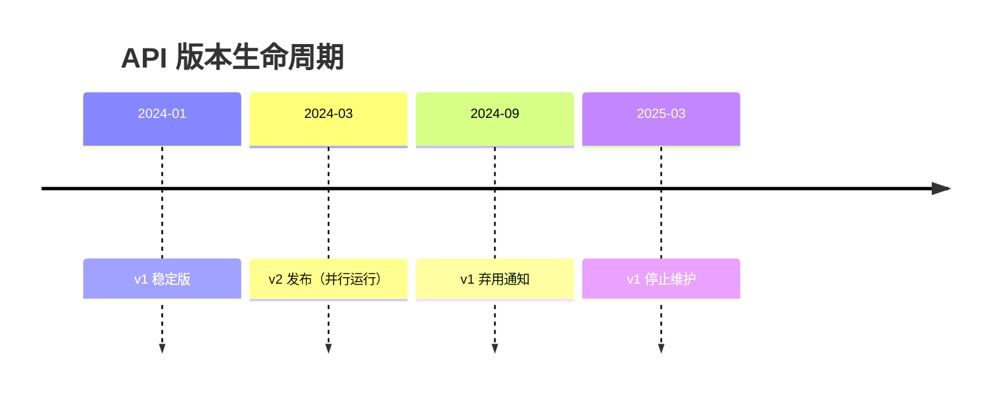
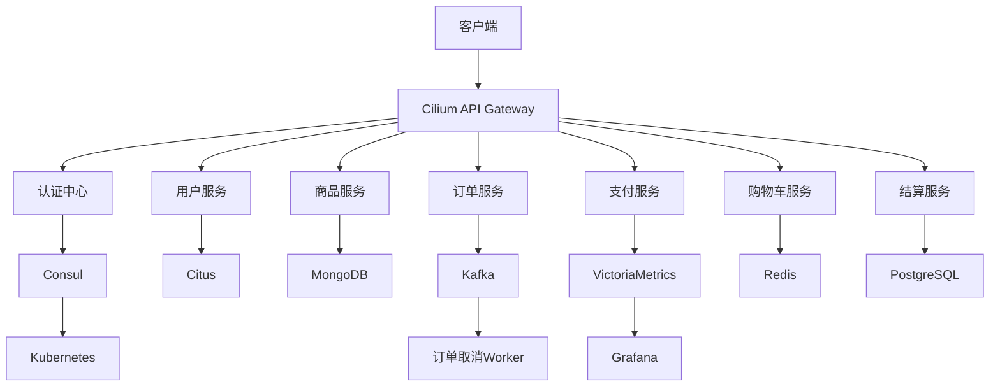
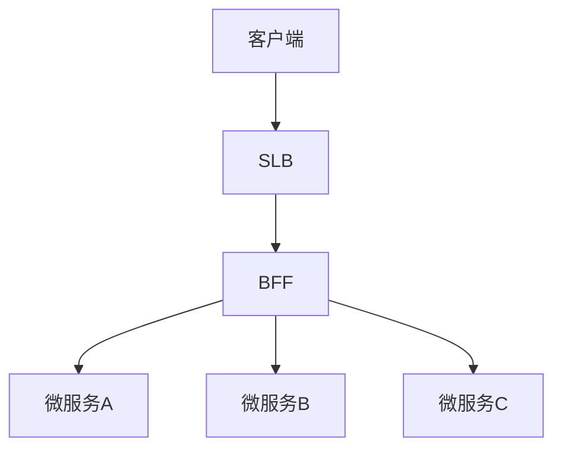
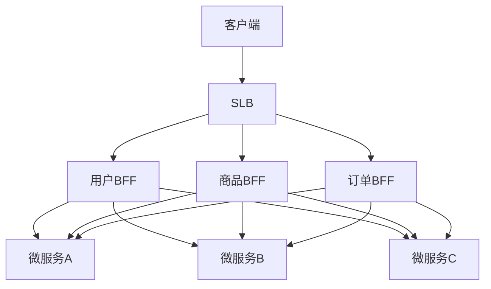
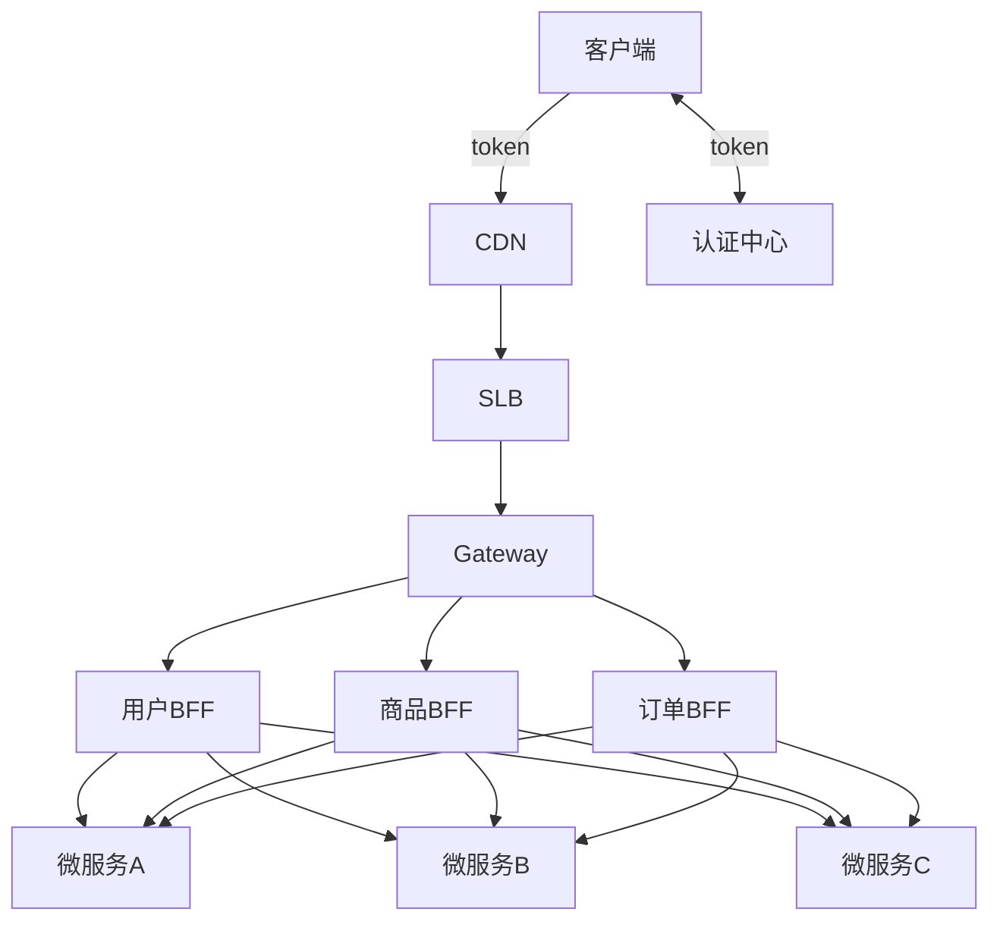
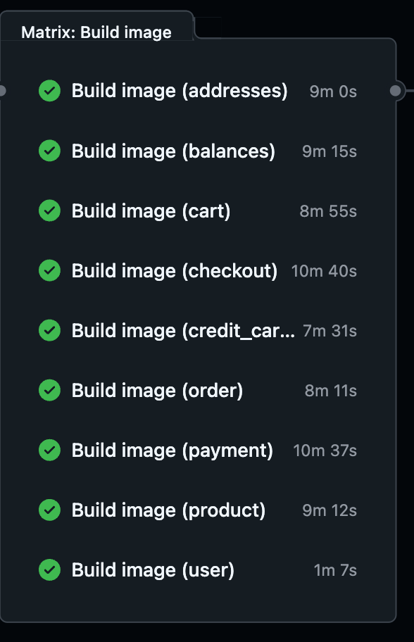
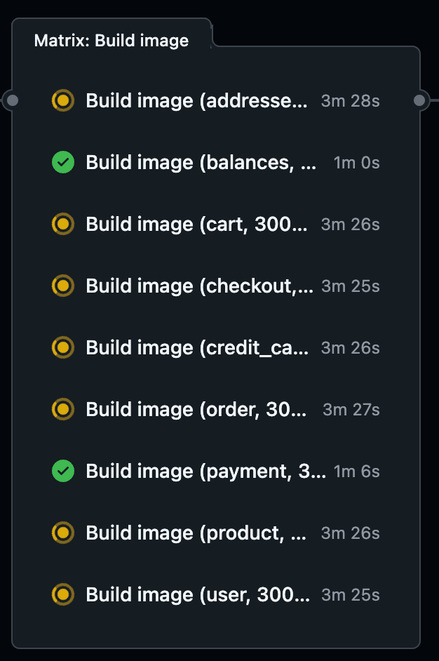
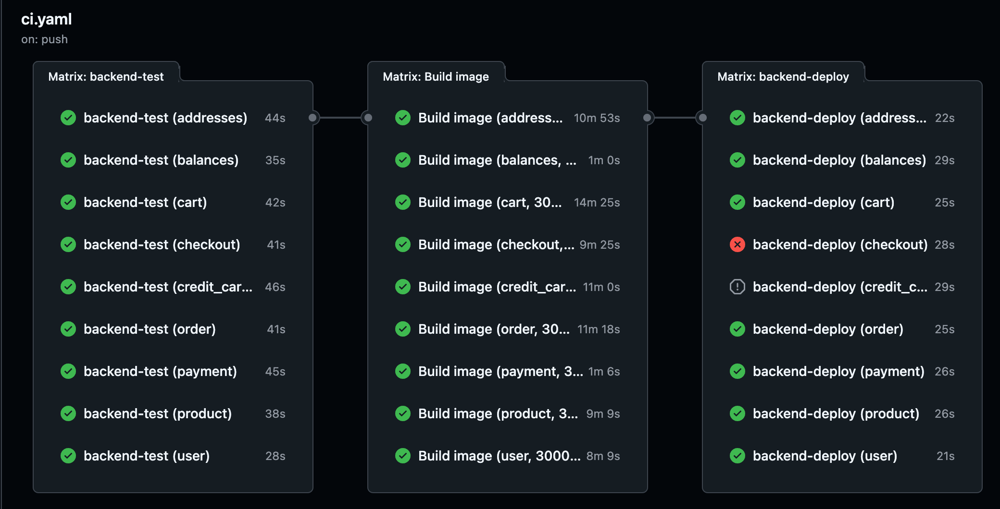

# 微服务架构

# 微服务优劣

简单举例优缺点, 更详细查看架构演进部分

## 优势

1. 将基础架构逻辑从业务代码剥离出来

2. 自由选择技术栈

3. 业务部分只关注业务逻辑

## 劣势

1. 带来更多的复杂性

2. 更多的运行实例

3. 额外的网络跳转

4. 处理更复杂的路由

5. 处理更复杂的类型映射

6. 服务与服务之间的整合

# Kubernetes

kubernetes缺少微服务的三大组件:

1. 精细化的服务治理, kubernetes缺少这种能力, 后面就有了服务网格的概念, 常见的就是istio, 加上作业调度就形成了服务治理的闭环

2. 

## 服务类型

### service

k8s内置的service类型, 它的功能是使用IPVS或IPTable四层技术去做的,它的负载均衡策略和高级能力是缺失的

### Ingress

外部对内部访问的一个服务类型

### Service Mesh

一个好的服务网格应该提供了以下能力:

#### 适应性

1. 熔断

2. 重试

3. 超时处理

4. 失败处理

5. 负载均衡

6. Failover

#### 可观察性

1. 指标

2. 监控

3. 分布式日志

4. 分布式链路追踪

#### 服务发现

1. 路由

#### 安全和访问控制

1. TLS

2. 证书管理

#### 部署

1. 容器

#### 通讯

1. HTTP

2. gRPC

3. Webstock

4. TCP

# 架构演进

单体架构 \-\> 服务总线 \-\> 微服务

## 巨石架构

优缺点:

优点:

- 方便测试和开发

- 方便部署

缺点:

- 当项目变得复杂时, 修改功能变得很麻烦, 例如你只想修改 A 功能, 但不知道为什么会影响到 B,C,D 功能

- 复杂的单体架构项目会导致 IDE 非常卡顿

- 依赖非常混乱

- 单体应用会打包并部署为单体式应用, 复杂的单体应用不利于扩展, 开发者难以搞懂, 难以开发

- 单体应用不利于敏捷性开发和部署

- 复杂的单体应用在部署之后启动时间会变得非常长

一句话, 化繁为简, 分而治之

## 微服务架构

当巨石架构引进微服务架构后会让子系统, 即微服务变得可控, 服务有单独的生命周期,让不同的人去关注自己的应用, 服务和外面的的边界就是自己的API\. 但整个生态会变得更复杂, 每个服务需要去做服务发现和配置和服务本身的配置


引入微服务可以带来以下优点:

- 代码小, bug 也小

- 易于测试

- 易于扩展

- 易于迭代

- 平滑上线

- 快速交付

- 契合持续集成的概念

- 快速验证

- 单一职责, 一个微服务可以衍生为只做一个功能

- 可靠性高, 不会像复杂单体架构上线部署启动 5 分钟

- 易于扩容缩容

- 去中心化, 微服务之间通过 rpc 来通讯, 而不需要通过 4 层 lvs 和 7 层 nginx 代理而引发的热点问题

缺点:

1. 对基础设施建设高度依赖, 因为多个微服务分散在不同节点上, 管理难度和复杂度变高, 需要配套的可观测性与监控

2. 分布式应用固有复杂性

3. 进程间通信带来的网络开销

4. 一致性难点

5. 分布式事务难点

6. 联调测试难度变高\. 一个业务可能会依赖多个微服务, 测试和调试也是一个问题

微服务的优点在项目早期的优势是不如单体架构的应用的, 但是在单体架构变得复杂是时, 达到一个临界点, 那么微服务架构对比单体架构的优势体现出来了


微服务也并不是没有缺点, 它对网络 IO 性能要求高的场景下的表现可能就不如单体架构, 因为应用的链路变长了, 网络IO 的性能势必会受到影响,而且微服务也绕不开分布式事务, 分布式缓存等等分布式问题, 对开发者的挑战也不小

# 微服务设计

## 接口设计

TODO

## 拆分微服务

从以下几点来拆分微服务:

- 性能

- 使用便捷性

- 业务领域

目前主流的划分微服务的方式有两种:

1. 业务职能\(Business Capabliity\): 按照部门提供的职能来划分, 例如客户部门提供客户服务, 财务部门提供财务服务

2. 限界上下文\(Bounded Context\): 限界上下文是 DDD 中用来划分不同业务边界的元素,业务边界的含义是"解决不同业务问题"的问题域和对应的解决方案域,为了解决某种类型的业务问题, 贴近领域知识, 也就是业务

还有一种是CQRS模式, 基于Pull vs Push模型将应用划分为两部分: 

- 命令端: 处理程序创建, 更新和删除请求

- 查询端: 通过针对一个或多个物化视图执行查询来处理查询, 这些物化视图通过订阅数据更新时发出的事件流而保持最新


## 错误处理

错误处理是至关重要的，那么如何正确处理和反应错误？应使用日志库和标准库的fmt\.Errorf等来搭配使用，日志库负责记录/上报。提供给开发和运维进行分析，而标准库的fmt\.Errorf包含错误的行号，上下文等关键信息，构造错误对象，封装错误上下文，建立错误链，正确的方法是记录日志并返回错误。那么微服务的架构设计中，一般分为：

### 最外层的HTTP/RPC层错误处理

它可能是中间件的形式，它应该对前端用户提供友好的错误信息，而不是具体的技术错误细节：

- 记录：请求摘要，记录请求级别信息，不重复内部细节，添加请求ID，并统一记录请求日志。

- 错误：转换错误为友好的用户消息。

### 服务层（service）

记录： 业务事件，记录业务事件状态变更，错误日志要谨慎

错误：业务逻辑错误

### 仓储层（data）

记录：技术细节， 详细记录数据库，外部API调用失败

错误：技术错误，包装原始技术错误（SQL，网络等）

### 基础设施（数据库，缓存，MQ等）

记录：取到级别日志，通常由库自身记录，你可配置日志级别

错误：原始错误

# 案例设计

## 搜索

当需要组合式查询时, 需要对数据库进行多条件检索, 这对写操作会带来影响, 那么这时候就可以引入 ES 来做全文检索, 避免对数据库进行多条件组合检索\. ES 偏向于运营类的检索查询

## Golang 内存池


可以手动管理内存, 比如一次申请 100M, 然后自己切割, 减少通过make和 new带来的 GC 压力


## 推荐系统

通过用户行为去收集用户的数据给大模型进行分析, 例如点击商品详情, 用户加入商品到购物车时发送数据给大模型进行训练推荐, 例如https://gorse\.io/zh/, 把用户行为的反馈写入Gorse。

## 热点数据

怎么判断是否是热点数据?  根据时间局部性原理\(在程序执行中的一个存储位置很有可能被不久的将来被再次被访问\), 设定一个时间内被访问的次数, 例如一分钟里被访问了1000次, 那么可以认定为短期热商品, 就可以加入到缓存中

### 方案

[缓存预热](https://i0jecrneytu.feishu.cn/docx/Wxd3dYf1joPR8jxa9yxc9FBln8e?from=from_copylink)

- 手动上传预热

    - 由管理员选择商品进行预热（例如：热销品，特价商品）

- 监控预热

## 优惠券服务

简单优惠券服务，来提升用户购物体验

### 优惠券类型

- 满减券

- 折扣券

- 立减券


# 可观测性设计

良好的可观测性设计能够全面、清晰地了解生产环境中的软件系统运行状态。通过收集和分析日志、指标、追踪等数据，可以实时掌握系统的健康状况、性能表现和潜在问题，从而快速定位和解决问题\.

通过系统的外部信号推断内部状态。不仅是传统的指标（Metrics）、日志（Logs）、追踪（Tracing）三根支柱的组合，而是一种综合性、全局化的分析方法。

可观测性的具体策略和工具：

应用日志：通过 Fluentd 或类似工具采集容器内的标准输出日志，帮助开发者定位应用问题。
集群日志：收集 Kubernetes 核心组件如 kube\-apiserver 和 etcd 的日志，适合排查系统级别的故障。
事件日志：利用 kubectl get events 快速了解集群中资源的状态变化。
审计日志：记录 API 请求，便于安全审查和权限问题的定位。
混沌工程：利用工具如 Chaos Mesh 和 Litmus Chaos，验证系统在高压或异常情况下的表现

## 

# 

## 去中心化

- 数据去中心化: 每个微服务独占一个数据库, 缓存

- 技术去中心化: 微服务之间的通讯协议不强绑定到某种语言的框架上


## 可用性 \& 兼容性设计

1. 隔离

2. 重试

3. 限流

4. 过载保护: 引入排队机制, 当服务压力大时让用户进行排队等待, 直到有人退出\. 可以使用时间窗口等算法来实现

5. 熔断

    1. 降级: 一个页面可能调很多微服务, 当非核心服务不可用时, 例如广告, 促销服务故障, 可以直接隐藏掉, 可以进行降级: 不显示广告和促销, 对整个系统的影响减少到最低

    2. 超时控制: 客户端调用服务时不报错也不响应, 例如卡超时, 连接卡在这里, 直接失败, 避免局部影响到全局故障

6. 负载均衡

    1. 随机

    2. 权重

    3. List 连接

    4. List Request, 并发连接最小

    5. 最快响应

## API 设计

### 兼容性设计

伯斯塔尔法则: *"Be conservative in what you send, be liberal in what you accept"*

**对发送的内容保守**：

发送数据时，应严格遵守协议规范，确保发送的内容符合标准。

避免发送模糊或不符合规范的数据，以减少接收方的处理负担。

**对接收的内容要宽容**：

在接收数据时，应尽量容忍不符合规范的数据，尝试解析并处理。

即使接收到的数据存在一些小问题，也应尽量处理，而不是直接拒绝。

### 版本设计

- 清晰的版本演进路径

- 无中断的版本升级

- 最大化代码复用

- 安全的并行运行环境

- 符合 Kubernetes 微服务部署要求


正确进行 API 版本升级（v1 → v2）：

1. **API 版本控制策略**

2. **proto 文件升级方案**

3. **目录结构调整**

4. **代码生成与路由配置**

5. **版本兼容性处理**

6. **具体实施步骤**

---

##### API 版本控制策略（遵循 Google API 改进准则）

**推荐方案：包名版本控制 \+ URI 路径版本**

```ProtoBuf
api/assistant/v2/assistant.protosyntax = "proto3";package assistant.v2;  // 包名带版本号service Assistant {rpc GetHelp (HelpRequest) returns (HelpResponse) {option (google.api.http) = {
      get: "/v2/assistants/{id}"  // URI 显式版本};}}
```

##### **版本兼容原则**

- 同时维护 v1/v2 版本至少 6 个月

- 使用语义化版本控制（SemVer）

- 通过 API Gateway 进行版本路由

- 使用 gRPC 同端口多版本支持

---

proto 文件升级规范

```protobuf
// api/assistant/v2/assistant.proto

// 第一行必须添加版本演进说明
// Versioning Policy:
// - v2 adds streaming support and extended metadata
// - Fields 1-10 reserved from v1, new fields start from 11

syntax = "proto3";

package assistant.v2;

import "google/api/annotations.proto";
import "protoc-gen-openapiv2/options/annotations.proto";

message EnhancedAssistant {
  string id = 1;
  // [新增字段] 使用明确的字段编号
  string v2_specific_field = 11; 
  google.protobuf.FieldMask update_mask = 12;
}

service AssistantV2 {
  rpc GetEnhancedAssistant(GetEnhancedAssistantRequest) returns (EnhancedAssistant) {
    option (google.api.http) = {
      get: "/v2/assistants/{id}"
    };
  }
}
```

目录结构调整方案

```ProtoBuf
api/
├── assistant
│   ├── v1
│   │   ├── assistant.pb.go          # 保持 v1 不变
│   │   └── assistant.proto
│   └── v2                          # 新增 v2 目录
│       ├── assistant.pb.go
│       ├── assistant.proto
│       └── assistant_http.pb.go
```

##### **数据库迁移策略**

使用扩展式表设计（避免破坏 v1）

```go
ALTER TABLE assistants ADD COLUMN v2_specific_field VARCHAR(255);CREATE INDEX idx_assistants_v2 ON assistants (v2_specific_field);
```

##### **缓存键版本隔离**

```protobuf
// internal/pkg/cache/keys.goconst (
    AssistantCacheKeyV1 = "v1:assistant:%s"
    AssistantCacheKeyV2 = "v2:assistant:%s"  // 明确版本隔离)
```

##### **领域模型演进**

```go
// internal/biz/assistant.gotype Assistant struct {
    ID               string
    V1LegacyField    string gorm:"column:v1_field"  // 保持 v1 兼容
    V2SpecificField  string gorm:"column:v2_field"}// 使用 GORM 标签保持字段兼容
```

**配置双版本路由**

`server/http.go`

```Plain Text
v1.RegisterUserServiceHTTPServer(srv, userv1)
v2.RegisterUserServiceHTTPServer(srv, userv2)
```

**数据库迁移（使用 golang\-migrate）**

```Plain Text
migrate create -ext sql -dir internal/data/migrations -seq add_v2_fields
```

测试双版本并行运行

```Plain Text
curl http://localhost:8000/v1/assistants/123
curl http://localhost:8000/v2/assistants/123
```

---

##### 关键注意事项

1. **版本生命周期管理**



2. **监控指标分离**

```Go
prometheus.NewCounterVec(prometheus.CounterOpts{
    Name: "api_requests_total",
    Help: "API requests total",
    ConstLabels: prometheus.Labels{"version": "v2",  // 版本标签"service": "assistant",},}, []string{"method"})
```

建议配合 CI/CD 流程增加版本兼容性测试：

```Plain Text
# .github/workflows/api-compat.ymlname: API Compatibility Check
on: [pull_request]jobs:proto-compat:runs-on: ubuntu-latest
    steps:- uses: bufbuild/buf-setup-action@v1
      - run: buf breaking --against ".git#branch=main"
```


### 单点/多点架构和API Gateway

南北向\(从集群外部到集群内部的流量\)为 Client 发送请求到 API Gateway， 由 API Gateway 分发流量到对应的微服务

东西向\(集群内从一个Pod到另一个Pod的流量。\)通过 rpc来交互



#### 单点 BFF架构

所有业务都放到单一BFF层来实现, 那么就会出现:

- 流量集中在 BFF 层, 一旦 BFF 层的某个环节出现问题, 那么整个BFF 层都会挂掉

- 所有业务集中在一个BFF 层, 不易于开发维护



#### 多点 BFF架构

在多点BFF 中, 业务可能分为几个大类, 例如用户,商品,订单, 然后其他杂项单独一个 BFF

尽管多点 BFF 可以把单点BFF的风险 分到其他 BFF 去, 但如果需要集成跨横切面的中间件, 例如

- 日志

- 熔断

- 限流

- 安全认证

这些跨横切面功能就需要BFF 去推动升级




针对单点BFF和多点 BFF 架构缺陷， 我们使用了 API Gateway， 把安全， 限流， 熔断， 统一认证这些跨横切面通用的逻辑都上放到了 API Gateway， 由 API Gatewa 来实现， 把 BFF 当成了一个基础设施， 实现关注点， 专门对业务进行兼容， 不对安全， 限流， 熔断， 统一认证这些跨横切面的逻辑这些通用逻辑维护, 实现关注点分离

它可以隔离和业务无关性的升级

#### API Gateway

设定速率限制和 IP 限制以防滥用


API Gateway从架构层面来说仍然是单点,类似之间我们SLB的故障\.可用性最大的一环是涉及核心组件的变更流程管理,其他的可用性这里基本类似微服务

业务流量架构:

客户端可以使用SSR来实现首屏秒开, 典型的APIGW架构:

微服务网关接收前端 HTTP请求, 升级HTTP协议为 gRPC协议, 然后重写前端路由路径到后端 RPC 接口, 后端返回application/grpc 二进制 JSON 格式, 在由网关转成application/json 响应给前端



### 安全设计

#### 流量控制

1. 无效请求直接拒绝

2. 设定速率限制和 IP 限制以防滥用

3. 实施负载均衡，探索 DDoS 保护选项

#### 安全认证

客户端登录认证成功之后颁发 Token, 每次API 请求都会带上来, 发送到 API Gateway, API Gateway认证成功就会返回一个用户ID, 为了防止外网有人恶意注入header,API Gateway需要踢掉这些外网的header,  API Gateway把经过验证用户把用户 ID下发到下游 BFF, 重新注入新的 header, 通过 head 方式拦截放到 rpc 里面, 例如 gRPC的 metadata或 HTTP 的 head 里, 然后交给 BFF 层去处理, BFF 层下发到微服务的时候就可以把用户 ID 作为参数去请求数据库之类的操作了, 例如 GetUser

## 部署

### 服务端**金丝雀发布**

1. 通过 ArgoCD ApplicationSet 实现自动分阶段部署

2. 使用 Istio VirtualService 进行流量切分

3. Prometheus 自动监控新版本关键指标

4. 通过自动化验收测试后完成全量发布

#### 客户端使用金丝雀方案

可以在客户端提供一个“加入Beta计划”的按钮, 用户点击之后就可以添加一个染色标签来实现Beta版本和稳定版本的区分, 让这些用户去使用beta这个标签的接口功能


## 微服务技术栈全景

### 基础设施

- Kubernetes:（**自动部署， 水平扩缩， 回滚**， **服务发现和负载均衡， 自我修复，密钥与配置管理**）

- API Gateway: 网络策略, 认证, 通用的功能

- Casdoor: 用户管理,认证, 鉴权

- ArgoCD: 灰度发布

- Docker: 打包, 测试, 开发

- ArgoCD: 部署

- Cert\-Manager: 证书管理

- 存储容器镜像: 

    - 公有云

        - TCR: 腾讯云容器注册表

        - ACR: 阿里云容器注册表

    - 本地云

        - Harbor: 私有容器注册表

### 前端

- [前端](https://node8.apikv.com:30020/)仓库

- [后端API 文档](https://app.apifox.com/invite/project?token=3j_9favhOghU57nmpYK8n)

- [微服务状态](http://159.75.231.54:8500/ui/dc1/services)

- 配置中心

### 基础 Kit

- Kratos

包含:

- 服务注册/发现

- 日志抽象

- 依赖注入

### 服务通信

- gRPC 

- Protobuf v3

- Protoc \(代码生成\)

### 流传输

- Kafka \(消息队列\)


# 分布式事务

在微服务架构中，每个微服务都有自己的数据库, 一个服务需要更新自己的数据库并发送事件到其他服务，这时候如何保证这两个操作的原子性?  事务一致性就是一个关键挑战

典型的场景就是支付, 支付方和微服务都是独立的, 下面有几种常见的模式:

- Transactional Outbox通过将事件暂存在数据库表，确保事务提交后事件能被处理。

- Polling Publisher则是具体的实现方式之一，通过轮询来发送事件，Transactional Log Tailing则是另一种更高效的实现方式，避免了轮询的开销。

- 2PC Message Queue则试图通过两阶段协议来直接协调消息队列和数据库事务，但实际应用中可能因为复杂性和性能问题而较少使用，更多是结合其他模式

## 幂等

一个很严重的问题是, 消息被重复投递, 如果相同的消息被投递了两次, 代入到支付场景中, 从 1w 变成了 2w\.

### 为什么消息被重复投递

比如余额宝处理完消息 msg 后, 发送处理成功的消息给支付宝, 正常情况支付宝都需要删除消息 msg, 那么此时 支付宝挂了, 重启的时候msg 还在, 那么就会继续发送消息 msg

### 解决消息被重复投递问题

全局唯一 ID \+ 去重表

## Best Effort\(最大努力交付\)

主要用于这样一种场景:

不同的服务平台之间的事务性保证

比如电商购物, 使用支付宝支付, 又比如玩网游时, 通过 App Store充值\.

以购物为例, 电商平台和支付平台是相互独立的\.

当对接支付宝交易接口时, 一般都会在支付宝的回调页面和接口里解密参数, 然后更新订单和支付服务里进行更新, 同时, 只有我们回调页面中输出了 success 字样或者标识业务处理成功相关状态码时, 支付宝才会停止回调请求, 否则它会尽最大努力重试\(每隔一段时间\)你的接口直到成功

所有努力送达的模型, 都必须是预先预扣\(预占资源\)的做法

那么, 当你的接口没有处理好这种重试类业务时, 或者回调类的业务的场景时, 需要注意, 当对方至少调用一次, 意味着可能调用多次, 那么你需要做好幂等性交易, 即多次调用产生一致的结果\.

可以通过全局唯一订单来做到, 当处理完成时在数据库标记完成状态, 每次对方发来回调时检查状态

避免中间人通过网络调包多次调用接口导致业务重复发放物品或, 权益等

## 模式

### Transactional Outbox **事务收件箱**


一种用于确保在数据库事务中同时处理业务操作和消息发布的机制。比如，当应用需要更新数据库并发送消息到消息队列时，如果直接发送消息可能在事务提交前失败，导致数据不一致。而Outbox模式是在同一个事务中将消息写入数据库的一个outbox表，然后通过其他机制（比如轮询或日志跟踪）来保证消息最终发送出去。这样就能保证消息和数据库操作的原子性

#### 核心思想

- 将业务操作和消息发送放在同一个数据库事务中，通过“收件箱表”暂存消息，确保两者的原子性。

#### 实现方式

1. **写入本地事务**：在业务操作的事务中，将需要发送的消息插入到 message 表。

```sql
BEGIN TRANSACTION;

UPDATE orders SET status = 'paid' WHERE id = 123;

INSERT INTO message (event_type, payload) VALUES ('OrderPaid', '{"orderId":123}');

COMMIT;
```

2. **异步发送消息**：后台进程（如定时任务）轮询 message 表，将消息发送到消息队列后删除记录。

#### 优点

因为都在同一个数据库执行, 那么只要实现了 ACID 的数据库都可以保证只要支付方扣了钱, 那么消息就能保存来下

#### 分布式事务中的体现

- **最终一致性**：保证数据库状态变更和消息发布的原子性，但消息发送可能延迟。

- **容错机制**：通过重试和幂等性解决消息重复或丢失问题。

#### 适用场景

- 微服务架构中需要跨服务事件通知（如订单支付后通知库存服务）。

### Polling Publisher **轮询发布者**


通过定期轮询数据库中的outbox表来发布消息的方式。比如，有一个后台进程每隔一段时间检查outbox表中是否有新记录，如果有就发送到消息队列，然后标记为已发送或删除。这种方法相对简单，但延迟可能较高，因为依赖于轮询间隔，而且频繁轮询可能对数据库造成压力

#### 核心思想

- 通过定期轮询数据库的 message 表，检测新消息并发送到消息队列。

#### 实现方式

- **定时任务**：每隔固定时间（如 1 秒）查询  message 表：

- sql

- 复制

- SELECT \* FROM outbox WHERE status = 'pending' LIMIT 100;

- **发送并标记**：发送成功后更新消息状态为 `sent` 或直接删除记录。

#### 分布式事务中的体现

- **简单但高延迟**：轮询间隔影响消息实时性。

- **数据库压力**：高频轮询可能对数据库造成负载。

#### 适用场景

- 对消息延迟要求不高的系统（如后台报表生成）。

### **Transactional Log Tailing 事务日志跟踪**


这种方法不直接操作应用数据库表，而是通过读取数据库的事务日志（比如MySQL的binlog或PostgreSQL的WAL）来捕获变更事件。然后解析这些日志，将相关的事件发布到消息队列。这样做的优点是可以实时捕获变更，减少延迟，同时不侵入应用代码，但需要处理日志解析的复杂性，并且对数据库的日志格式有依赖。

#### 核心思想

- 通过解析数据库的事务日志（如 MySQL 的 binlog、PostgreSQL 的 WAL），实时捕获数据变更并发布消息。

#### 实现方式

1. **日志捕获**：使用工具（如 Debezium）监听数据库日志。

2. **事件解析**：将日志中的 `INSERT/UPDATE/DELETE` 操作转换为事件。

3. **发布消息**：将事件直接发送到消息队列（如 Kafka）。

#### 分布式事务中的体现

- **实时性高**：无轮询延迟，接近实时发布。

- **解耦应用**：无需修改业务代码，直接通过日志捕获变更。

#### 适用场景

- 有一些业务场景, 可以直接使用主表被 canal订阅使用, 有一些业务场景自带这类 message 表, 比如订单和交易流水, 可以直接使用这些流水表作为 message表使用

- 需要实时数据同步的场景（如数据仓库ETL、缓存更新, 订单, 交易流水）。

### 

### **2PC（两阶段提交）**

两阶段提交协议\(Two Phase Commitment Protocol\)

涉及到两种角色:

- 事务协调者: 负责协调多个参与者进行事务投票及提交

- 多个事务参与者: 即本地事务执行者

总体步骤:

1. 投票阶段: 协调者将通知事务参与者准备提交或取消事务, 然后进入表决过程\. 参与者将告知协调者自己的决策:

    1. 同意: 事务参与者本地事务执行成功, 但未提交

    2. 取消: 本地事务执行故障

2. 提交阶段: 收到参与者的通知后, 协调者在向参与者发送通知, 根据反馈情况决定各个参与者是否提交或者回滚


这种模式其实不符合微服务架构下的每个微服务独占一个数据库的模型, 但是二阶段的思路可以借鉴

## 二阶段提交消息队列\(2PC MQ\)

借鉴了 2PC, 引入一个 MQ 来解决微服务架构下的分布式事务场景\. 在分布式事务中使用两阶段提交协议来协调消息队列和数据库操作，确保两者要么都成功，要么都失败。比如，在事务的第一阶段，预提交消息到队列，然后在第二阶段确认提交或回滚。

之前的模式中, 它们都是在本地事务创建一个msg 消息表, 这在微服务架构上不太"优雅", 这时候就可以使用消息队列来模仿二阶段提交的实现: 两个本地事务 \+ 异步消息队列

#### 核心思想

- 将消息队列的提交与数据库事务绑定，通过两阶段提交协议（2PC）保证两者的原子性。

#### 实现方式

1. **Prepare Phase**：

    - 应用向消息队列发送“预提交”消息（消息暂存，不可消费）。

    - 提交本地数据库事务。

2. **Commit Phase**：

    - 事务提交成功后，消息队列确认提交，消息变为可消费状态。

    - 若事务失败，消息队列回滚删除消息。


##### 生产者

1. 准备阶段: 发送一个 **Perpared \(预准备消息\)给 MQ, 消息暂存, 没有提交**

    1. 错误处理: 发送一个 Perpared失败时直接给用户返回错误

2. 执行本地事务: 让支付宝先扣钱

    1. 事务执行失败处理: 回滚 

3. 提交本地事务,  向MQ主动发送确认消息

    1. 异常情况:

        1. 超时: 重试

        2. 发送确认消息失败: 回滚

##### 消息队列

- 当收到生产者的确认消息之后, 可以进行消费:

    - 通知下游\(Push\): 推送到下游微服务让下游进行消费

    - 下游拉取\(Pull\): 下游微服务自动获取 MQ的消息进行消费

##### 消费者

4. 接收消息

5. 执行本地事务: 余额加钱成功或失败

    1. 错误处理: 

        1. 重试, 重试失败则需要人工手动处理, 在系统实现回滚非常复杂, 很容易出 BUG

6. 发送确认消息

    1. 向MQ 发送 ark 消息, 让它删除该消息

### 分布式事务中的体现

- **强一致性**：保证数据库和消息队列的原子性。

- **解耦**: 通过消息中间件来解耦微服务之间的耦合

- **复杂性和性能**：2PC 的协调者可能成为单点故障，且网络延迟较高。

#### 缺点

- 复杂

- 因为它使用行级别的锁会导致在提交前都是没有被释放的, 会影响效率

#### 适用场景

- 强一致性要求的金融交易系统（如跨行转账）。

## Seata 2PC

解决了2PC MQ 所带来的使用行级别的锁会导致在提交前都是没有被释放的, 会影响效率问题, 引入了 TC, 

文档https://seata\.apache\.org/

go 文档: https://github\.com/apache/incubator\-seata\-go

## TCC\(Try\-Confirm\-Cancel\)

引入冻结概念, 在本地表添加一个 frozen\_amount 字段, 用于冻结当前的金额


流程:

1. 支付服务: 预先扣减余额, 冻结余额字段添加扣减的余额

2. 余额服务: 冻结金额字段添加被扣减的余额

3. 


### 注意点

#### 空回滚

#### 访悬挂

# 可观测性

## 监控

- 接口的响应时间

- 接口请求和响应值

## 分布式追踪

用于分析性能, 查询接口信息, 接口日志

技术栈:

- Opentelemetry（中间件， 采集 Merits/Logs/Traces 并转发到对应的后端）

- Jaeger（链路追踪， 可视化）

## 分布式日志

## 日志的作用

使用日志来快速定位问题\. 在应用发布之后, 查看日志有没有报错, 可能本地测试是没问题的, 上线之后就有可能出问题\.

根据日志来查询错误的详细信息, 具体修复错误的问题也会非常快

## 日志记录

- 应用日志

- 审计日志

- 数据库日志

    - sql 执行性能

    - sql 代码

- 缓存日志

- MQ日志

### 日志分级

按照日志的分级来实现优先级

- 重要

    - 审计类

    - Error

- 次要

    - Info

    - Warn

    - Debug

### 日志采集系统

#### 大型微服务

app \-\> fluentd \-\> Kafka \-\> 裁剪和解析\(Fink或 Log \) \-\> Elastcsearch \(存储\. 检索, 日志解析\) \-\> Kibana\(查询\)

app 生产本地日志, 由fluentd采集, 写到 kafka, 使用 fink 入库或使用 Log 解析? 再发送到Elastcsearch, 由 Kibana 查询

#### 小型微服务

使用 Loki \-\> Grafana

### 日志格式

使用 JSON 作为日志输出格式, 

- time: 日志产生时间

- level: 日志等级

- app\_id: 应用 id, 标识日志来源

- instance\_id: 实例 id, 区分同一个应用不同的实例, 可以使用 hostname 区分


如果日志量大, 那么可以按照冷热分离思想, 最近三天的日志为热数据, 三天后的数据

## 日志选型

- ELK\(完整日志系统\)

- EFK\(完整日志系统\)

- Fink: 分布式计算

- Loki（日志存储）


## 日志安全

当有人在打日志时泄露了用户账号, 密码, token ,手机号等机密时, 需要进行过滤或去敏

## 指标

## 作用

- 可以查询应用性能有没有下降


- Grafana（可视化）

- VictoriaMetrics（时序存储）

### DevOos

常见的 CI平台

- GitHub Actions

- GitLab CI

### RPC

- gRPC

### 服务治理

- Consul（服务注册/发现, 动态配置, 健康检查）

### 配置

#### 线上

- Consul Config

- Kubernetes ConfigMap

- Kubernetes Secrets

#### 开发

- Local env

- File env

### 数据存储

#### 分布式存储Citus

在使用 Citus 集群时，先阅读 [Citus 官方文档](https://docs.citusdata.com/en/stable/get_started/concepts.html)，了解其架构设计与核心概念。

其中核心是了解 Citus 中的五种表，以及其特点与应用场景：

- 分布式表（Distributed Table）

- 参考表（Reference Table）

- 本地表（Local Table）

- 本地管理表（Local Management Table）

- 架构表（Schema Table）

#### 文档数据库MongoDB

#### 缓存Dragonfly

#### 静态文件存储 Minio

## 规范

### [微服务项目规范](https://i0jecrneytu.feishu.cn/docx/ZZm2dyIGKo4k3gxK4MccOFOlnfb?from=from_copylink)

### 优化过程

Docker build 构建未优化前：



之前在测试使用这种方法： 在 `matrix` 中定义了三个数组：

- `service`（9 个值）

- `http_port`（9 个值）

- `grpc_port`（9 个值）

这将导致生成的任务数量为： `9 (service) * 9 (http_port) * 9 (grpc_port) = 729`，这个数量已经超出了 GitHub Actions 的默认限制 `256`。

```YAML
service: [ addresses, balances, cart, checkout, credit_cards, order, payment, product, user ]  # 定义要并行执行的服务
http_port: [30015, 30017,  30003, 30005 ,30007, 30009, 30011, 30013, 30001]
grpc_port: [30016, 30018,  30004, 30006 ,30008, 30010, 30012, 30014, 30002]
```

当意识到该问题后， 将代码优化一个数组包含三个值， 优化之后变成 9 个任务数量

```YAML
- { service: addresses, http_port: 30015, grpc_port: 30016 }
- { service: balances, http_port: 30017, grpc_port: 30018 }
- { service: cart, http_port: 30003, grpc_port: 30004 }
- { service: checkout, http_port: 30005, grpc_port: 30006 }
- { service: credit_cards, http_port: 30007, grpc_port: 30008 }
- { service: order, http_port: 30009, grpc_port: 30010 }
- { service: payment, http_port: 30011, grpc_port: 30012 }
- { service: product, http_port: 30013, grpc_port: 30014 }
- { service: user, http_port: 30001, grpc_port: 30002 }
```



符合实际的需求，

在一个 ci 文件使用了 matrix 就可以解决多个微服务的部署了， 这很方便， 看起来没有问题。

但在我们部署了多个微服务之后， 我们发现：

1. 每个任务都得等前面的任务全部执行完才继续执行下一个任务

2. 当一个 job 中的任务失败了， 该 job 标记被失败

这显然不是我们需要的



我们重新梳理了需求：

~~例如： user 这个 test 完成了就进入到 user 的 build， 而不是 build 都要等 test 的其它的任务这个 job 全部执行完才继续~~

