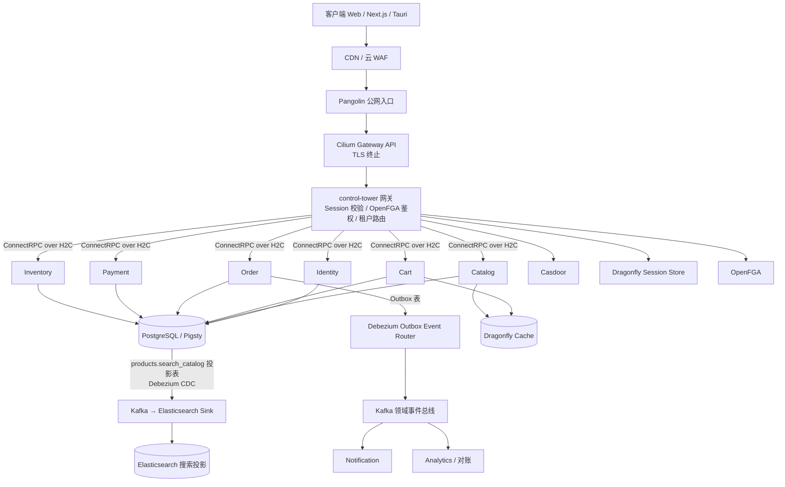
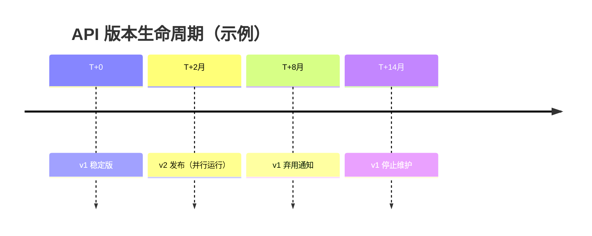
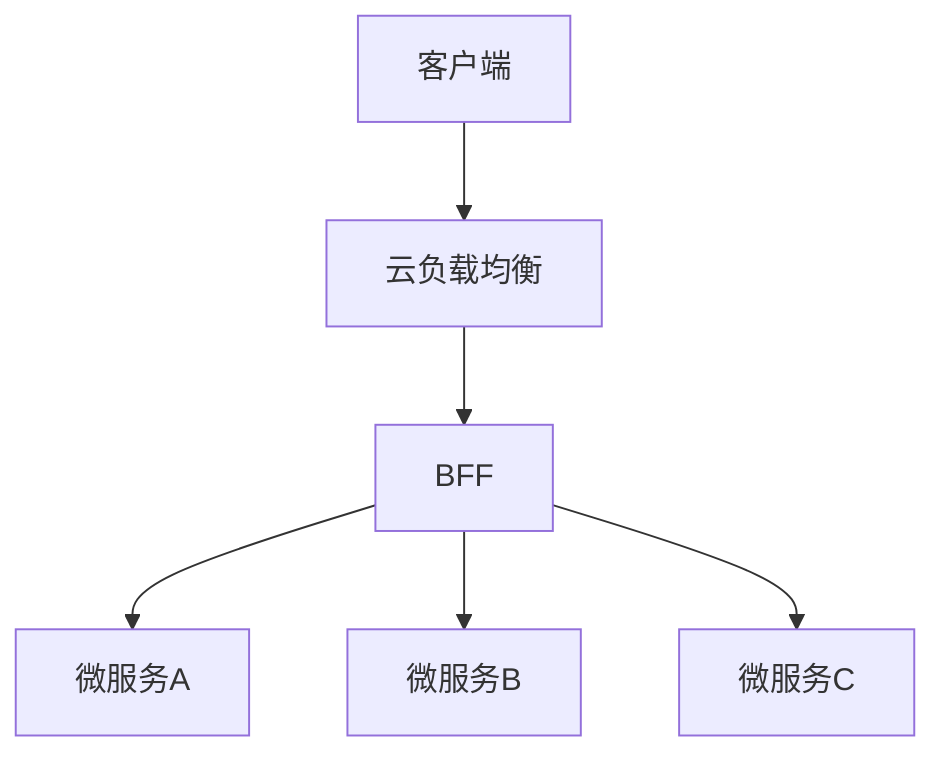
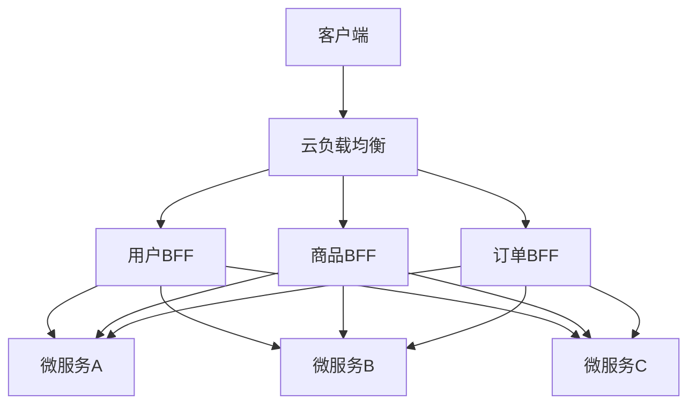
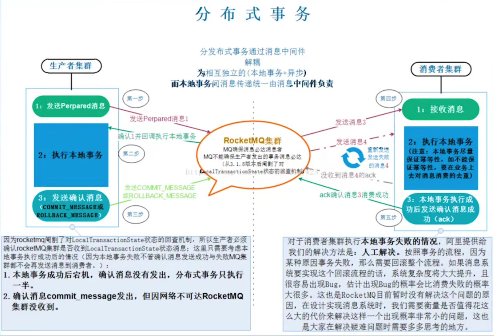

# 微服务架构

> 2025-01 初稿；2026-09-03 按当前定稿（`ecommerce/docs/TECH.md`、`ecommerce/STACK.md`、本仓库 `components/*/README.md`）与业界变化修订。变更清单见附录「修订记录」，原稿存档为同目录 `微服务架构.2025-01.原稿.md`。

阅读顺序：先看第 1、2 章建立全貌，再按需进入各章。

- [1. 架构演进与取舍](#1-架构演进与取舍)
- [2. 技术栈全景](#2-技术栈全景)
- [3. 微服务设计](#3-微服务设计)
- [4. API 设计](#4-api-设计)
- [5. Kubernetes 与流量入口](#5-kubernetes-与流量入口)
- [6. 可用性与弹性设计](#6-可用性与弹性设计)
- [7. 安全设计](#7-安全设计)
- [8. 分布式事务](#8-分布式事务)
- [9. 可观测性](#9-可观测性)
- [10. 部署与交付](#10-部署与交付)
- [11. 数据存储与配置](#11-数据存储与配置)
- [12. 案例设计](#12-案例设计)
- [附录](#附录)

# 1. 架构演进与取舍

本章回答：为什么从单体走向微服务，代价是什么，什么时候该拆。演进路径是单体 → 模块化单体 → 微服务；服务总线（ESB）是 SOA 时代的中间形态，现已少见。

## 单体架构

优点：

- 方便测试和开发
- 方便部署

缺点：

- 当项目变得复杂时，修改功能变得很麻烦，例如只想修改 A 功能，却影响到 B、C、D 功能
- 复杂的单体项目会导致 IDE 非常卡顿
- 依赖非常混乱
- 单体应用打包并部署为一个整体，复杂后不利于扩展，开发者难以搞懂、难以开发
- 不利于敏捷开发和部署
- 复杂的单体应用启动时间会变得非常长

一句话：化繁为简，分而治之。

## 模块化单体

拆微服务之前的中间态：单个可部署单元内按限界上下文划分模块，模块之间只通过显式接口调用，数据库按模块分 schema。它保留了单体的开发与部署便利，又把边界先立起来，日后拆服务时只需把接口换成 RPC。

## 微服务架构

引入微服务后，子系统即微服务变得可控，服务有单独的生命周期，让不同的人关注自己的应用，服务和外界的边界就是自己的 API。但整个生态会变得更复杂，每个服务都需要服务发现、配置和自身的运行时配置。

优点：

1. 独立部署与独立伸缩：每个服务有自己的生命周期，按各自负载扩缩
2. 故障隔离：一个服务故障不应拖垮整体（前提是做了超时、熔断、降级）
3. 技术栈自由：服务间只通过契约（Protobuf）耦合，不绑定语言与框架
4. 团队自治：服务边界即团队边界，业务代码只关注领域逻辑
5. 代码小、bug 影响面小；单一职责，易于测试与迭代
6. 启动快、平滑上线，契合持续集成

缺点：

1. 复杂性上移到基础设施：服务发现、配置中心、网关、可观测性、CI/CD 都成了前置条件
2. 分布式固有复杂性：更多实例、更多网络跳转，延迟、超时、重试、幂等都要显式设计
3. 一致性：跨服务只能最终一致，需要 Outbox / Saga（见第 8 章）
4. 联调与测试成本：一个业务链路依赖多个服务
5. 更依赖 L4 / L7 代理与客户端负载均衡，长连接场景尤其如此（见第 5 章「HTTP/2 长连接与负载均衡」）
6. 网络 IO 敏感的场景下链路变长，性能受影响

微服务在项目早期的优势不如单体。单体变复杂到达临界点后，微服务的优势才体现出来。


## 何时拆

不按数据库表或名词拆服务。只有以下条件之一成立时才拆出独立服务：

- 需要独立伸缩（负载特征差异大）
- 团队边界成立（可以由一个小组独立演进）
- 故障域需要隔离

否则优先放入对应领域模块（模块化单体），保留清晰边界，日后再拆。新增服务须先用 ADR 证明必要性。

# 2. 技术栈全景

本章一页看全当前定稿的组件与流量路径，细节在后续各章。

## 总体架构



流量入口链：CDN / 云 WAF → Pangolin 公网入口 → Cilium Gateway API（TLS 终止）→ control-tower 网关 → 业务服务。

数据流分两条线（2026-09-03 定稿）：**领域事实线**——业务事务写 outbox 表，Debezium Outbox Event Router 读 WAL 投递到 Kafka，franz-go + Inbox 消费者处理副作用；**行投影线**——PostgreSQL 投影表由 trigger 维护，Debezium 普通表捕获经 Kafka Connect Sink 写入 Elasticsearch。搜索投影走行投影线，不经领域事件。判据与边界见第 8 章「两条数据线」。

## 运行平台

| 组件 | 职责 |
|---|---|
| Kubernetes（kubeadm 单控制面，3 节点 ARM64） | 调度、部署、扩缩、自愈 |
| Cilium 1.20.1 | CNI、kube-proxy replacement（严格模式）、Gateway API 1.6.1、CiliumNetworkPolicy、Hubble |
| OpenEBS LVM | 本地卷 |
| cert-manager + trust-manager | 自签根 CA 与 `global-ca-issuer` 签发；CA bundle 分发到各 namespace |
| Kyverno | 准入策略 |
| KEDA / VPA | 事件驱动扩缩 / 仅 recommender 出推荐值 |
| Spegel | 节点间 P2P 镜像缓存 |
| TCR / Harbor / GHCR | 主镜像仓库 / Helm OCI 制品 / 可选双存 |

## 身份与授权

| 组件 | 职责 |
|---|---|
| Casdoor | IAM：登录、OAuth / OIDC、MFA、粗粒度角色 |
| Dragonfly Session Store | 有状态 Session（`noeviction` + 持久化） |
| OpenFGA | 对象级关系授权（ReBAC） |
| OpenBao + External Secrets Operator | 凭据下发为 Kubernetes Secret，密钥不入 Git |

## 通信与契约

| 组件 | 职责 |
|---|---|
| ConnectRPC（connect-go） | 同步 RPC，服务间与网关到后端统一 HTTP/2（H2C） |
| Protobuf 3 + Buf CLI + Buf Schema Registry | 契约定义、lint、breaking 检查、代码生成、模块管理 |
| Protovalidate + `connectrpc.com/validate` | 请求参数校验 |
| Fx | 依赖注入与生命周期 |
| pgx + sqlc + goose | PostgreSQL 驱动、类型安全查询生成、迁移 |
| zap + otelzap；go-redis + redisotel | 日志与缓存客户端，自带 OTel 埋点 |

## 事件与一致性

| 组件 | 职责 |
|---|---|
| PostgreSQL Outbox 表 | 业务写与事件同事务；outbox 列按 CloudEvents 属性设计，不维护 `published_at` / `attempts` 簿记 |
| Kafka Connect + Debezium（领域事实线） | Outbox Event Router 读 WAL 按提交序投递；Connect 在 Kafka `acks=all` 后才推进复制槽位点；自写 relay 已退役（2026-09-03） |
| Kafka Connect + Debezium（行投影线） | 普通表捕获：PostgreSQL 投影表 `products.search_catalog` → Kafka → Elasticsearch Sink；两条线的表互不进对方的 publication / connector |
| Apache Kafka（KRaft，非 K8s 独立集群；客户端 franz-go） | 唯一领域事件主干；Topic 按限界上下文划分，partition key = `aggregate_id` |
| Inbox 幂等表 | 主键 `(consumer_group, event_id)`；连续失败 5 次转 DLQ 并告警；只在领域事实线需要 |
| Protobuf + Buf Schema Registry；CloudEvents 信封 | 事件 Schema 与兼容性；信封含 `event_id`、`aggregate_id`、`tenant_id`、`trace_id`、`schema_version`、`occurred_at`；行投影线不 CE 化 |
| KEDA Kafka scaler | 按 consumer lag 扩缩领域事实线的 franz-go 消费者；行投影线的 Sink 由 Connect 自身管理 |

## 数据

| 组件 | 职责 |
|---|---|
| PostgreSQL（外部 Pigsty：Patroni 自动 Failover + PgBouncer） | OLTP 唯一真相源；UUIDv7 默认主键；每服务一个 schema；客户端 TLS `verify-ca` |
| Dragonfly | 缓存；Session / Cache / 限流三套实例分离 |
| Elasticsearch 9.x + IK | 只读搜索投影 |
| Silo（基于 MinIO） | S3 兼容对象存储，Versioning + Lifecycle，预签名 URL 上传 |
| ClickHouse / DuckDB | 触发式 OLAP / 零常驻跑批（对账、报表） |
| Gorse | 推荐引擎（协同过滤） |

## 可观测

| 组件 | 职责 |
|---|---|
| OTel SDK → 外置 OTel Collector | trace / metric / log 走 OTLP；Collector 做尾采样、PII 脱敏、噪声过滤、批处理 |
| VictoriaMetrics / VictoriaLogs / VictoriaTraces | 指标 / 日志 / 链路存储 |
| Vector（DaemonSet）、VMAgent | 容器日志采集与 VRL 脱敏；指标抓取 |
| Grafana | 看板 |
| vmalert + Alertmanager → ntfy；Gatus；Bugsink | 指标告警；黑盒探测；前端错误监控 |

## 交付与开发内环

| 组件 | 职责 |
|---|---|
| Docker Buildx | 多架构镜像（`linux/amd64,linux/arm64`） |
| GitHub Actions / GitLab CI / Renovate | 发布链 / 代码门禁 / 依赖更新 |
| Cosign、Syft、Trivy、Gitleaks、zizmor | 签名、SBOM、漏洞扫描、密钥扫描、CI 配置检查 |
| Argo CD + ApplicationSet；Argo Rollouts | GitOps；金丝雀 |
| `make dev`、mirrord、Okteto | 本地直连；观察用 mirror；接管用 Okteto |

## 已废弃与待触发

| 已废弃 | 替代 |
|---|---|
| Kratos、kratos-gateway | ConnectRPC、control-tower |
| Consul KV | Config Center（Consul 注册发现为存量迁移期） |
| NATS JetStream（已删除） | Kafka |
| Meilisearch | Elasticsearch（切流后退役） |
| 集群内 CNPG（休眠） | 外部 Pigsty |
| Istio（`archive/`） | 暂不引入网格 |
| Jaeger | VictoriaTraces |

待触发：Temporal（P2，长流程编排）、Chaos Mesh（仅 staging）、OpenCost、Pyroscope、Istio Ambient。

# 3. 微服务设计

本章回答：怎么划边界、读写怎么分、错误怎么传。

## 拆分微服务

拆分依据（按优先级）：

1. 一致性边界：需要强一致的数据放在同一个服务内（订单和订单行；库存流水和余额）。跨服务只通过事件最终一致
2. 变化率隔离：商品目录变化慢，购物车变化快，订单和支付频率适中但安全要求高，分开部署和扩展
3. 团队拥有：每个服务可由一个小组独立开发和演进
4. 语言边界：每个服务内部使用统一的领域语言，不同服务的术语不混用

主流的两种划分方式：

1. 业务职能（Business Capability）：按部门提供的职能划分，例如客户部门提供客户服务，财务部门提供财务服务
2. 限界上下文（Bounded Context）：DDD 中划分业务边界的元素。业务边界指「解决某类业务问题」的问题域与对应的解决方案域，贴近领域知识

配套实践：事件风暴（先找领域事件再找聚合与边界）；康威定律 / 团队拓扑（服务边界与团队边界对齐）。

本项目的限界上下文：Identity / Catalog / Cart / Order / Payment / Inventory / Fulfillment / Notification，另有 analytics、reconciliation 等编舞消费者；搜索投影不是事件消费者，走行投影线（CDC）。存量 10 个服务（user / search / behavior / product / cart / address / order / inventory / merchant / payment）是迁移起点。

## CQRS

CQRS 把**写模型（命令）与读模型（查询）分离**：

- 命令端：处理创建、更新、删除请求，写入唯一真相源（PostgreSQL），并通过 Outbox 发布领域事件
- 查询端：针对一个或多个物化视图执行查询。物化视图订阅事件流保持最新，可从真相源全量重建

本项目中搜索（Elasticsearch）、缓存（Dragonfly）、分析（ClickHouse / DuckDB）都是可重建的派生读模型。


## 去中心化

- 数据去中心化：每个微服务独占自己的数据库 schema 与缓存实例；跨服务查询靠事件投影（CQRS 读模型）或 API 组合，不共享表
- 技术去中心化：服务间通信协议不绑定某种语言的框架（Protobuf + ConnectRPC）

## 错误处理

原则：**一个错误只处理一次**。内层用 `fmt.Errorf("op: %w", err)` 包装后返回，只在边界层（RPC 拦截器）记录一次并转换为对外错误。每层都打日志会让同一错误重复出现多次，反而难以排查。

`fmt.Errorf` 不记录行号和调用栈，只做字符串拼接和 `%w` 包装。需要定位时在包装处写清操作名和关键 ID（订单号、SKU），并在日志里带上 `trace_id`。

工具：

- `errors.Is` / `errors.As`；Go 1.26 新增泛型版 `errors.AsType`
- `errors.Join` 与多个 `%w`（Go 1.20+）合并多个错误
- 日志：zap + otelzap（本项目），或标准库 `log/slog`

分层职责：

| 层 | 记录什么 | 返回什么 |
|---|---|---|
| 传输层（Connect 拦截器） | 一次请求级日志：request id、trace id、方法、耗时、错误码；不重复内部细节 | 领域错误映射为 Connect 错误码，对外只给友好信息，不泄露技术细节 |
| 业务层（biz） | 业务事件与状态变更；通常不在这里打错误日志 | 领域错误（proto 定义的 reason 枚举） |
| 数据层（data） | 不打日志 | 包装原始技术错误（SQL、网络），附带操作上下文，不吞错 |
| 基础设施（数据库、缓存、Kafka） | 库自身的日志，按级别配置 | 原始错误 |

# 4. API 设计

本章回答：契约怎么写、怎么保持兼容、怎么升版本。

## 契约约定

| 项 | 约定 |
|---|---|
| 契约 | Protobuf 3 + Buf CLI（`buf lint` / `buf breaking` / `buf generate`），模块与兼容性由 Buf Schema Registry 管理。proto3 语法仍受支持；Protobuf 官方已推出 Editions（最新 `edition = "2024"`），新工程可评估，存量不必迁 |
| 传输 | ConnectRPC（connect-go）。同一实现同时讲 Connect / gRPC / gRPC-Web 三种协议；服务间与网关到后端统一 HTTP/2（H2C），严禁降级 HTTP/1.1 |
| 校验 | Protovalidate（CEL 表达式写在 proto 里）+ `connectrpc.com/validate` 拦截器。PGV 已进入维护模式，不再使用 |
| 前端 | Protobuf-ES + Connect Query ES，与后端共享同一份 proto |
| 命名 | RPC 用动词 + 名词（`ReserveStock`、`GetListingForCheckout`）；路径由 Connect 固定为 `/<package>.<Service>/<Method>`，版本号放在 package 名里 |
| 标识 | 资源 ID 用 UUIDv7；金额用 `int64` 分或 decimal 字符串，不用浮点 |
| 幂等 | 写操作携带 `idempotency_key`，服务端以唯一约束去重 |
| 错误 | 用 Connect 错误码（`InvalidArgument`、`NotFound`、`FailedPrecondition`…）表达类别，用 proto 定义的错误详情表达业务原因；不用 HTTP 状态码承载业务语义 |
| 分页 | 游标分页，不用 offset |

## 兼容性设计

伯斯塔尔法则：*"Be conservative in what you send, be liberal in what you accept"*

- 对发送的内容保守：严格遵守协议规范，不发送模糊或不符合规范的数据
- 对接收的内容宽容：容忍不影响语义的小问题（未知字段、字段顺序）

当代修正：RFC 9413（2023）指出无限宽容会导致协议僵化与安全问题。现在的做法是**严格校验输入、快速失败**——用 Protovalidate 在入口拒绝非法请求，只对「未知字段」保持宽容以支持滚动升级。

Protobuf 兼容规则：不改字段编号与类型、不复用已删除的编号（用 `reserved`）、只增不删、新字段必须可选；`buf breaking` 在 CI 里强制。

## 版本设计

目标：

- 清晰的版本演进路径
- 无中断的版本升级
- 最大化代码复用
- 安全的并行运行环境
- 符合 Kubernetes 微服务部署要求

v1 → v2 升级的六个步骤：版本控制策略 → proto 升级 → 目录结构 → 代码生成与路由 → 兼容性处理（数据库、缓存、领域模型）→ 生命周期与 CI。

### 版本控制策略

推荐方案：**包名带版本**。Connect 的路径由 package 与 Service 名决定，版本号自然进入路径。

```protobuf
// api/assistant/v2/assistant.proto
syntax = "proto3";

package assistant.v2;  // 包名带版本号

service AssistantService {
  // Connect 路径：POST /assistant.v2.AssistantService/GetAssistant
  rpc GetAssistant(GetAssistantRequest) returns (GetAssistantResponse);
}
```

兼容原则：

- 同时维护 v1 / v2 至少 6 个月
- 库与 proto 模块使用语义化版本（SemVer）
- 通过网关按路径前缀路由版本
- 同一进程、同一端口同时注册 v1 与 v2 handler

### proto 文件升级规范

```protobuf
// api/assistant/v2/assistant.proto

// 第一行必须添加版本演进说明
// Versioning Policy:
// - v2 adds streaming support and extended metadata
// - Fields 1-10 reserved from v1, new fields start from 11

syntax = "proto3";

package assistant.v2;

import "google/protobuf/field_mask.proto";
import "buf/validate/validate.proto";

message EnhancedAssistant {
  string id = 1 [(buf.validate.field).string.uuid = true];
  // [新增字段] 使用明确的字段编号
  string v2_specific_field = 11;
  google.protobuf.FieldMask update_mask = 12;
}

message GetEnhancedAssistantRequest {
  string id = 1 [(buf.validate.field).string.uuid = true];
}

service AssistantService {
  rpc GetEnhancedAssistant(GetEnhancedAssistantRequest) returns (EnhancedAssistant);
}
```

### 目录结构

```text
api/
└── assistant
    ├── v1
    │   ├── assistant.proto
    │   ├── assistant.pb.go              # 保持 v1 不变
    │   └── assistantv1connect/          # connect-go 生成
    └── v2                               # 新增 v2 目录
        ├── assistant.proto
        ├── assistant.pb.go
        └── assistantv2connect/
```

### 代码生成与双版本路由

```go
// server/http.go
mux := http.NewServeMux()
mux.Handle(assistantv1connect.NewAssistantServiceHandler(v1Svc, interceptors))
mux.Handle(assistantv2connect.NewAssistantServiceHandler(v2Svc, interceptors))
srv := &http.Server{Addr: ":8000", Handler: h2c.NewHandler(mux, &http2.Server{})}
```

验证两个版本并行：

```bash
curl -X POST http://localhost:8000/assistant.v1.AssistantService/GetAssistant \
  -H 'Content-Type: application/json' -d '{"id":"123"}'
curl -X POST http://localhost:8000/assistant.v2.AssistantService/GetEnhancedAssistant \
  -H 'Content-Type: application/json' -d '{"id":"123"}'
```

### 兼容性处理

数据库用扩展—收缩（expand / contract）两步走，避免破坏 v1：

1. 扩展：只加列、加表、加索引，v1 与 v2 同时可用
2. 收缩：v1 下线并过了回滚窗口后，再删旧列

```sql
-- goose 迁移：internal/data/migrations/00012_add_v2_fields.sql
-- +goose NO TRANSACTION
-- CREATE INDEX CONCURRENTLY 不能在事务内执行
-- +goose Up
ALTER TABLE assistants ADD COLUMN v2_specific_field VARCHAR(255);
CREATE INDEX CONCURRENTLY idx_assistants_v2 ON assistants (v2_specific_field);

-- +goose Down
DROP INDEX IF EXISTS idx_assistants_v2;
ALTER TABLE assistants DROP COLUMN v2_specific_field;
```

缓存键按版本隔离：

```go
// internal/pkg/cache/keys.go
const (
    AssistantCacheKeyV1 = "v1:assistant:%s"
    AssistantCacheKeyV2 = "v2:assistant:%s" // 明确版本隔离
)
```

领域模型只有一份，v1 / v2 各自做 DTO 映射；数据访问用 sqlc 生成的查询，列变更走迁移：

```go
// internal/biz/assistant.go
type Assistant struct {
    ID              string
    LegacyField     string // v1 仍在用，收缩阶段删除
    V2SpecificField string
}
```

### 生命周期与弃用信号



弃用信号要机器可读：

- HTTP 响应头 `Deprecation`（RFC 9745，2025-03）：值必须是日期，形如 `Deprecation: @1735689600`，不能写 `true`
- HTTP 响应头 `Sunset`（RFC 8594）：写明停止服务日期
- proto 层：`option deprecated = true;`

### 监控指标分离

指标按 `api.version` 属性区分，便于观察 v1 流量是否归零：

```go
requests, _ := meter.Int64Counter("api.requests")
requests.Add(ctx, 1, metric.WithAttributes(
    attribute.String("api.version", "v2"),
    attribute.String("service", "assistant"),
    attribute.String("method", procedure),
))
```

### CI 兼容性检查

`bufbuild/buf-setup-action` 已弃用，统一用 `bufbuild/buf-action`：

```yaml
# .github/workflows/api-compat.yml
name: API Compatibility Check
on: [pull_request]
jobs:
  proto-compat:
    runs-on: ubuntu-latest
    steps:
      - uses: actions/checkout@v4
      - uses: bufbuild/buf-action@v1
        with:
          lint: true
          breaking: true
          breaking_against: "https://github.com/${{ github.repository }}.git#branch=main"
```

# 5. Kubernetes 与流量入口

本章回答：Kubernetes 自己能做什么、缺什么，流量怎么进集群、怎么到达服务。

## Kubernetes 提供什么、缺什么

Kubernetes 提供：自动部署与回滚、水平扩缩、Service 级服务发现与 L4 负载均衡、自我修复、ConfigMap / Secret。

Kubernetes 不提供，需要额外组件补齐的三块：

1. 精细化服务治理：L7 路由、超时、重试、限流、熔断、mTLS。由 Gateway API、应用网关，或可选的服务网格承担
2. 应用级可观测性：链路、业务指标、结构化日志。由 OpenTelemetry SDK + Collector + 存储后端承担
3. 数据一致性与事件：Outbox、Saga、消息总线。由应用层与 Kafka 承担

## Service

Kubernetes 内置的 Service 只做 L4 转发（ClusterIP / NodePort / LoadBalancer），没有 L7 负载均衡策略、重试、熔断等高级能力。

数据面实现：

| 模式 | 状态 |
|---|---|
| iptables | 上游默认；规则数随 Service 线性增长 |
| nftables | Kubernetes 1.33 GA，O(1) 分发，大规模集群推荐 |
| IPVS | Kubernetes 1.35 起弃用（KEP-5495），不再用于新部署 |
| eBPF（Cilium kube-proxy replacement） | **本集群方案**：KPR 严格模式，完全绕过 iptables / IPVS |

Service 的 `trafficDistribution` 字段（`PreferSameZone` / `PreferSameNode`）在 Kubernetes 1.35 GA，可让流量优先落在同可用区或同节点的端点，降低跨区延迟与成本。

## HTTP/2 长连接与负载均衡

ConnectRPC / gRPC 走 HTTP/2 长连接。ClusterIP 只在**建连时**选一次 Pod，之后所有请求都钉在这条连接上，导致扩容后的新 Pod 接不到流量、负载不均。

处理方式：

1. Headless Service + 客户端 DNS 解析出全部 Pod IP，客户端做健康过滤与 P2C / 轮询选点。control-tower 网关当前对 Consul 返回的实例做健康过滤 + P2C，迁到 Kubernetes Service + CoreDNS 时，若要保留网关侧选点，需要用 headless Service 拿到 Pod 列表，而不是 ClusterIP 一个 VIP
2. 流量经 Gateway API / L7 代理按请求均衡
3. 服务端限制连接最大寿命或最大请求数，迫使客户端周期性重连再选点

与灰度的关系：Argo Rollouts 基于 Service / HTTPRoute 权重的切分要求流量经过 Service，不能直连 Pod IP。当前 Consul 直连 Pod IP 是存量，迁到 Kubernetes Service + CoreDNS 后权重切分才生效。

## Gateway API（替代 Ingress）

- Ingress API 已冻结，不再新增功能；ingress-nginx 控制器于 2026-03-31 退役，不再有安全补丁
- Gateway API 是 SIG Network 的替代标准：`Gateway` 描述监听器，`HTTPRoute` / `GRPCRoute` / `TLSRoute` / `TCPRoute` 描述路由，角色分离（平台管 Gateway，业务管 Route）。v1.5（2026-02-27）把 CORS filter、TLSRoute v1、ListenerSet 转入 Standard；本集群安装 v1.6.1，10 个 CRD 全装，TCPRoute 可用
- 本集群：`default/cilium-gateway` 是唯一 L7 入口，80 端口重定向、443 端口终结 TLS，证书是 cert-manager `global-ca-issuer` 签发的 `*.${CLUSTER_DOMAIN}` 泛域名证书。路由约定见 `components/gateway/README.md`

## Service Mesh

一个服务网格应提供的能力：

| 能力域 | 内容 |
|---|---|
| 适应性 | 熔断、重试、超时处理、失败处理、负载均衡、Failover |
| 可观测性 | 指标、监控、分布式日志、分布式链路追踪 |
| 服务发现 | 路由 |
| 安全和访问控制 | mTLS、证书管理、L7 授权 |
| 通讯 | HTTP、gRPC、WebSocket、TCP |

形态与本项目结论：

- Sidecar 模式（每 Pod 一个 Envoy）资源开销大；Istio ambient（无 sidecar：ztunnel 做 L4，waypoint 做 L7）已于 2024-11 GA，2026 年又推进多集群 Beta，是新部署的首选形态
- 本项目**暂不引入网格**：Cilium Mutual Authentication 在 1.20.1 仍是 Beta 且官方自述安全模型不完整；小集群没有可靠的每节点 Envoy 内存基准。将来确需 workload mTLS + L7 授权时，评估对象是 Istio Ambient
- 节点间加密先用 Cilium WireGuard（零应用改造）
- 没有网格兜底，限流、熔断、重试、灰度必须在网关、应用或 Kubernetes 层显式设计（见第 6 章）

## 南北向与东西向：从 BFF 到 API Gateway

南北向（从集群外部到集群内部的流量）：客户端发送请求到网关，由网关分发到对应的微服务。

东西向（集群内从一个 Pod 到另一个 Pod 的流量）：通过 RPC 交互。

### 单点 BFF

所有业务都放到单一 BFF 层实现，会出现：

- 流量集中在 BFF 层，某个环节出问题，整个 BFF 层都会挂掉
- 所有业务集中在一个 BFF 层，不易于开发维护



### 多点 BFF

按业务大类拆 BFF，例如用户、商品、订单，其他杂项单独一个 BFF。

多点 BFF 把单点 BFF 的风险分散了，但横切面能力（日志、熔断、限流、安全认证）需要每个 BFF 各自升级：



### 上收到 API Gateway

针对单点 BFF 和多点 BFF 的缺陷，把安全、限流、统一认证这些横切面逻辑上收到 API Gateway，由网关统一实现；BFF 只做业务兼容与聚合，不再维护通用逻辑，实现关注点分离，并隔离与业务无关的升级。

## control-tower 网关

本项目网关是自研的 control-tower（Connect 原生反向代理），请求处理顺序：

1. recover → otelhttp → access log → CORS
2. 剥离所有入站 `x-md-global-*` 身份头（防止外网伪造）
3. 路由与匿名清单匹配
4. Session 校验（Dragonfly Session Store）
5. 授权：OpenFGA 关系鉴权（目标），Casbin RBAC 为待替换存量
6. 注入可信身份头（`x-md-global-user-id`、`x-md-global-merchant-id`…）+ 路由级总超时
7. 健康过滤 + P2C 选点 → H2C 转发到后端 Connect 服务

网关从架构层面仍是单点：以多副本 + PDB（`minAvailable: 1`）保证可用性；可用性最大的一环是核心组件的变更流程管理。

协议说明：ConnectRPC 的 Connect 协议可以直接用 JSON 或二进制 Protobuf over HTTP/1.1 或 HTTP/2 被浏览器调用，因此**不需要 gRPC-JSON 转码网关**；网关对内只做 H2C 透传。gRPC 的载荷是 Protobuf 二进制，不是「二进制 JSON」。

首屏：公开可收录页（商品详情起步）由 Next.js SSR / ISR 承载，登录后交易页与 Merchant / Admin / Tauri 留 SPA，两者共享 API 契约。

## 服务发现

| 环境 | 方案 |
|---|---|
| 生产（K8s） | Kubernetes Service + CoreDNS，`<service>.<namespace>.svc.cluster.local` |
| pre 半生产测试 | Docker Compose 服务名 |
| Mac 开发内环 | 本地 `make dev` 直连；观察用 mirrord mirror；接管用 Okteto |

- 配置层抽象 `ServiceRegistry` 接口，业务代码不感知发现机制
- Consul 为存量迁移期：KV 已退役，仍在网关选点热路径；迁移完成后退役
- HashiCorp 产品 2023-08 起为 BSL 许可，2025-02 被 IBM 收购，不再作为新依赖引入

# 6. 可用性与弹性设计

本章回答：没有网格兜底时，每种韧性手段落在哪一层。

| 机制 | 做法 | 本项目落点 |
|---|---|---|
| 隔离 | 舱壁模式：按调用方划分连接池与并发配额 | 缓存分实例；数据库每服务一个 schema |
| 超时 | 全链路传播 `context` deadline | 网关设置路由级总超时 |
| 重试 | 只对幂等操作重试，指数退避加抖动 | 网关默认不重试 |
| 限流 | 令牌桶，或自适应并发限制（BBR 类） | 网关按用户 / 租户限流（只有网关拿得到 Session 与身份）；限流状态放独立 Dragonfly 实例 |
| 过载保护 | 一般场景自适应限流 + 快速失败；秒杀类场景引入排队，让用户等待直到有人退出 | — |
| 熔断与降级 | 非核心服务（广告、促销、推荐）故障时直接隐藏，把影响降到最低 | 当前网关没有熔断；引入前先定义失败语义、幂等边界和压测验收 |
| 负载均衡 | 随机、加权、最少连接、最少请求、P2C（Power of Two Choices）、EWMA 最快响应 | 网关健康过滤 + P2C |
| 弹性伸缩 | HPA 管在线请求服务；KEDA 以 Kafka consumer lag 管消费者；两者不控同一资源 | `lagThreshold: "50"`；VPA 只出推荐值 |
| 高可用调度 | 反亲和与拓扑分布、PDB、N+1 容量冗余 | `maxSkew: 1`；gateway 双副本 `minAvailable: 1` |

# 7. 安全设计

本章回答：流量怎么防滥用、身份怎么校验与传递、网络与供应链怎么收紧。

## 流量控制

1. 无效请求直接拒绝（Protovalidate 在入口校验）
2. 网关按用户 / 租户限流；IP 限制只对 NAT 前有效
3. WAF、Bot 与大流量 DDoS 清洗放在云边缘，不由自研网关承担

## 安全认证

系统废弃 JWT 架构，采用 **Casdoor 为 IAM + Dragonfly 持久化 Session Store + OpenFGA 关系授权** 的零信任体系：

1. 登录：control-tower 以机密客户端与 Casdoor 完成 OAuth2 / OIDC code 交换，浏览器不持有 token
2. 会话：Web 用 httpOnly cookie，Tauri 用 session header；token 与角色只存在网关侧 Dragonfly（`noeviction` + 持久化）；登出即删 session key，立即失效
3. 网关剥离外网可能伪造的 `x-md-global-*` 头，校验 Session 后重新注入可信身份头
4. 授权：网关调用 OpenFGA Check（user / merchant / store / order 关系模型）做对象级授权；粗粒度角色归 Casdoor
5. 后端只信任网关注入的身份头，不解析浏览器凭据，并以数据库状态机兜底业务约束（例如 `GetUser` 只按注入的用户 ID 查询）
6. 访客：网关签发签名 cookie，同时注入 `x-md-global-anonymous=true`；访客只拥有购物车，下单一律升级为登录态
7. 第三方 API：HMAC 签名 + API Key，映射为对应 Merchant 身份

红线：不允许同时维护 JWT 兼容逻辑或双重鉴权路径。

## 网络与传输

- 所有 Namespace default-deny，只放行 Gateway → control-tower → 业务服务 → 数据依赖的白名单流量（CiliumNetworkPolicy）
- 每服务独立 ServiceAccount 与最小 RBAC，关闭无用的 token automount
- mTLS 分阶段：先 Cilium WireGuard 节点间加密；确需 workload mTLS + L7 授权时评估 Istio Ambient；SPIFFE / SPIRE 暂不引入

## 供应链

- PR 门禁：Gitleaks（密钥）、zizmor（CI 配置）、Trivy fs / config
- 发布链：Syft SBOM（SPDX）→ Trivy image 按 digest 扫描（可修复 HIGH / CRITICAL 阻断）→ Cosign keyless 签名与 attestation
- 准入：Kyverno `verifyImages`（已装，策略待启用）

# 8. 分布式事务

本章回答：跨服务怎么做到最终一致。主线是 Outbox + Saga + 幂等 + 对账；2PC、事务消息、Seata 只作参考。

## 问题定义

微服务架构中每个服务独占自己的数据库。一个服务需要更新自己的数据库并发送事件到其他服务时，如何保证「改库」和「发事件」的原子性？这是跨服务一致性的核心问题。典型场景是支付：支付方与业务服务相互独立。

跨服务不做分布式强一致（2PC / XA），改为：**本地事务保证单服务正确性，可靠事件投递 + Saga 补偿 + 幂等消费 + 对账保证跨服务最终一致**。

## 可靠事件投递：Outbox + 搬运层 + Inbox

### Transactional Outbox（事务发件箱）


把业务写操作和「待发布事件」写在同一个本地事务里：事件先落在 outbox 表（发件箱），事务提交后由搬运层发到消息队列。只要数据库实现了 ACID，就能保证「扣了钱，事件一定被记录下来」。

```sql
BEGIN;

UPDATE orders SET status = 'paid' WHERE id = '01917c2e-...';

INSERT INTO outbox (id, source, type, aggregate_id, tenant_id, traceparent, schema_version, occurred_at, payload)
VALUES (
  '01917c2e-...',                      -- event_id，UUIDv7
  'order-service',
  'com.example.order.paid.v1',         -- reverse-DNS，过去式
  '01917c2e-...',                      -- partition key
  'tenant-a',
  '00-4bf92f3577b34da6a3ce929d0e0e4736-00f067aa0ba902b7-01',
  1,
  now(),
  '\x0a0b...'::bytea                   -- Protobuf 二进制
);

COMMIT;
```

要点：

- outbox 表的列按 CloudEvents 属性设计，幂等键 `(source, id)`，`type` 用 reverse-DNS 过去式
- 以 `aggregate_id` 作为 Kafka partition key 保序；投递顺序由 WAL 提交序决定，不靠 `occurred_at` 排序（`occurred_at` 是事务内的 `now()`，不等于提交序）
- `traceparent` 随事件进入 Kafka header，消费者据此续接链路
- 表里不维护 `published_at` / `attempts` / `last_error` 簿记：搬运层的复制槽位点就是游标

搬运层有两种实现：轮询发布者与事务日志跟踪。**本项目定稿事务日志跟踪（Debezium Outbox Event Router）**，轮询发布者只作参考。

### Transactional Log Tailing（事务日志跟踪）— 本项目采用


不轮询业务表，而是读取数据库事务日志（PostgreSQL 的 WAL 逻辑复制、MySQL 的 binlog）捕获变更并发布到 Kafka。

1. 日志捕获：Debezium（PostgreSQL 用 `pgoutput` 逻辑复制槽）
2. 事件解析：Outbox Event Router SMT 把 outbox 表的每一行转成一条领域事件，CloudEvents 属性以 Kafka header（binary mode）承载
3. 发布：Kafka Connect 写入 Kafka；Connect 在 broker `acks=all` 后才推进 `confirmed_flush_lsn`

- 按提交序、无轮询延迟、不侵入业务代码，outbox 表零簿记
- 代价是复制槽运维：被监控表长期无写入时位点不推进、WAL 无限滞留（Debezium 需要 `lsn.flush.mode = connector_and_driver`；实测过滞留 256 MB、每天约 280 MB 增长）；告警必须盯复制槽位点差、connector task 状态和 consumer lag，不能只看容器与 connector 的 `RUNNING`
- 本项目两条线都跑在同一套 Kafka Connect + Debezium 上：**领域事实线**用 Outbox Event Router 搬 outbox 表，**行投影线**用普通表捕获搬 `products.search_catalog` 投影表到 Elasticsearch Sink；两条线的表互不进对方的 publication / connector

### Polling Publisher（轮询发布者）— 参考，本项目不采用


后台进程定期查询 outbox 表中未发布的记录，发到 Kafka，收到 broker `acks=all` 响应后才标记 `published`。

```sql
SELECT * FROM outbox
WHERE published_at IS NULL
ORDER BY occurred_at
LIMIT 100
FOR UPDATE SKIP LOCKED;   -- 多 relay 实例并发时不互相阻塞
```

- 简单，不依赖数据库日志格式；延迟取决于轮询间隔，高频轮询对数据库有压力，常用「有新事件时 NOTIFY 唤醒 + 兜底定时轮询」缓解
- 本项目曾自写过这样一个 relay（约 750 行），2026-09-03 退役且不重写成 Kafka 版：它在 PG 事务与 `FOR UPDATE` 锁内向 broker 发送，`ORDER BY occurred_at` 不等于提交序，还要自己维护 `published_at` 簿记与清理门禁；当初选它的理由是「零新组件」，而 Kafka Connect 成为生产组件后这个前提不再成立
- 适用：栈里确实没有 Kafka Connect / Debezium 的场景

### 两条数据线：行投影走 CDC，领域事实走 Outbox

给一条数据流分线只问一个问题：**没有这个事件，业务语义会不会丢失？**

| 答案 | 归属 | 需要的拼图 | 搬运层 | 例子 |
|---|---|---|---|---|
| 会（行变更表达不了这个业务事实） | 领域事实线（Outbox） | 原子性 outbox + 搬运 + 传输 + 信封四块全要，消费端 Inbox 幂等 | Debezium Outbox Event Router → Kafka → franz-go + Inbox 消费者 | `OrderPaid`、`OrderReadyForFulfillment` |
| 不会（PG 行的派生物，随时可重建） | 行投影线（CDC） | 只要搬运与传输 | Debezium 普通表捕获 → Kafka → Kafka Connect Sink | 搜索投影 `products.search_catalog` → Elasticsearch |

跨表聚合不是选 Outbox 线的理由——把聚合物化成 PG 侧 trigger 维护的投影表，CDC 线就能搬。这条判据来自一次分类错误：搜索投影曾被当作事件平台的首个租户，背上了整套四块拼图，而它的生产者从未存在；同期另一条 Debezium → Kafka → Elasticsearch Sink 链早已零代码跑通。决策经过见 `ecommerce/context/project/ecommerce/events/experience/row-projection-vs-domain-event.md`。

### Inbox（收件箱）与幂等消费

消息至少投递一次，消费者必须幂等：

- 消费端维护 `inbox_events` 表，主键 `(consumer_group, event_id)`；重复消费时唯一键冲突直接忽略
- 领域逻辑与写 Inbox 在同一本地事务，然后提交 offset
- 连续失败超过 5 次转投 DLQ Topic 并触发告警，禁止无休止重试阻塞 partition
- 状态即真相：以数据库状态机表达流程进度，不依赖消息到达顺序推断

## 跨服务流程：Saga

Saga 把一个跨服务的业务流程拆成一串本地事务，每一步都有对应的补偿动作；某一步失败时按逆序执行补偿，而不是回滚。

| 模式 | 适用场景 | 驱动机制 | 一致性 |
|---|---|---|---|
| 编排（Orchestration） | 核心交易链路：Checkout → 价格快照 → 库存预占 → 支付意图 | Order Service 内置 Saga Process Manager 显式调度状态迁移、超时定时器与逆向补偿 | 强反馈：用户即时得到「库存不足」 |
| 编舞（Choreography） | 派生与副作用：搜索投影、通知、分析、对账 | 主流程达成阶段性终态时经 Outbox 发布领域事件，下游各自订阅 | 最终一致 |

两者组合使用：编排流程的每个关键阶段都可以触发编舞事件（库存预占成功 → `StockReserved`）；外部编舞事件（支付回调发出的 `PaymentCaptured`）也可以作为输入驱动编排状态机前进。

治理要求（必须随事件驱动一起落，否则流程失控）：

- 幂等消费：见 Inbox
- 显式补偿事件：`StockReserveFailed → 订单自动取消` 这类补偿是一等公民，不散落在各处
- 状态即真相：Saga 状态与 `order_status` 共同表达进度
- 超时兜底 job：扫 `pay_deadline` 与卡在中间态的订单做补偿或告警；编排器必须有 backstop
- 事件可靠性：Topic 按限界上下文划分，`aggregate_id` 为 partition key，连续失败超 5 次转 DLQ

补偿设计注意：补偿也要幂等；补偿是语义上的反向动作（释放预占、退款），不是数据库回滚；状态机只允许合法迁移（`CANCELLED` 不能回到 `PAID`）。

长流程引擎：Temporal 待触发（跨服务超过 24h 的 durable workflow ≥ 3 条、单流程 ≥ 8 个持久步骤等信号出现时评估）；PostgreSQL 任务表需要通用化时先看 River（Go + PG 事务型队列）。

## 需要同步反馈的段落：预占 / 确认 / 释放


库存这类需要用户即时反馈的资源，用「预占—确认—释放」三段式（TCC 风格）：

1. Try / 预占：`ReserveStock`——在库存表里把数量从 `available` 移到 `reserved`（冻结），单条语句同时完成「检查余额足够」和「扣减」，保证 `available >= 0`
2. Confirm / 确认：支付成功后 `ConfirmStock`，把 `reserved` 转为实际扣减
3. Cancel / 释放：下单失败、取消或预占过期时 `ReleaseStock`，把 `reserved` 退回 `available`

多商家订单组把这组接口收敛为全组原子的 `ReserveGroup` / `ConfirmReservationGroup` / `ReleaseGroup`，一次请求一个库存事务。

三个注意点：

| 问题 | 场景 | 处理 |
|---|---|---|
| 空回滚 | Try 没有执行（请求丢失或超时）但 Cancel 先到了 | Cancel 识别「没有对应的预占记录」并直接返回成功，不报错、不负扣 |
| 防悬挂 | Cancel 已执行后，迟到的 Try 才到达，资源被永久冻结 | 以订单号 + SKU 记录「已取消」标记，Try 看到标记直接拒绝 |
| 幂等 | Try / Confirm / Cancel 都可能被重试 | 三者按预占记录 ID 幂等：重复 Confirm 不重复扣减，重复 Cancel 不重复退回 |

## 幂等

一个很严重的问题是消息被重复投递。相同的消息投递两次，代入支付场景，从 1 万变成了 2 万。

为什么会重复：余额宝处理完消息 msg 后，发送处理成功的消息给支付宝，正常情况支付宝需要删除消息 msg。此时支付宝挂了，重启时 msg 还在，就会继续发送消息 msg。至少一次投递意味着一定会重复。

解决方案：

- 全局唯一 ID（UUIDv7）+ 去重表（唯一约束），冲突即忽略
- 状态机：只允许合法迁移，重复请求落在同一终态
- 写接口带 `idempotency_key`：同一键只创建一个订单
- HTTP 层的 `Idempotency-Key` 头目前仍是 IETF 草案，语义可参考，不依赖标准化

## 最大努力交付（外部平台回调）

主要用于不同服务平台之间的事务性保证：电商购物使用支付宝支付，玩网游通过 App Store 充值。

以购物为例，电商平台和支付平台相互独立。对接支付宝交易接口时，在回调接口里验签、解密参数，更新订单和支付服务。只有回调输出了 `success` 或业务处理成功的状态码，支付宝才会停止回调，否则它会尽最大努力按间隔重试直到成功。

- 所有努力送达的模型，都必须是预先预扣（预占资源）的做法
- 对方至少调用一次，意味着可能调用多次：回调必须幂等——以全局唯一订单号处理，完成后在数据库标记状态，每次回调先查状态
- 必须验签（支付宝 RSA2），避免中间人调包多次调用接口导致重复发放物品或权益
- 支付回调进入 Payment Service 的 `HandlePaymentCallback`，处理后发布 `PaymentCaptured` 事件驱动订单状态机

## 对账

事务协议解决不了的问题由对账兜底：

- 日切对账：拉取支付渠道账单，与本地 `PaymentAttempt` / `Capture` / `Refund` 记录逐笔核对
- 差错处理：单边账（渠道有、本地无）走补单；本地有、渠道无走查询确认或人工处理
- 对账跑批用 DuckDB 读账单文件与 PG 导出，零常驻
- 库存对账：`StockLedger` 流水汇总应等于 `StockItem` 余额

## 参考：其他协议与工具（本项目不采用）

### 2PC（两阶段提交）


两阶段提交协议（Two Phase Commitment Protocol）涉及两种角色：

- 事务协调者：协调多个参与者进行事务投票及提交
- 事务参与者：本地事务执行者

步骤：

1. 投票阶段：协调者通知参与者准备提交或取消事务，参与者反馈自己的决策——同意（本地事务执行成功但未提交）或取消（本地事务执行故障）
2. 提交阶段：协调者根据反馈通知各参与者提交或回滚

问题：参与者在两阶段之间持有数据库锁；协调者是单点；不符合每个微服务独占数据库的模型。PostgreSQL 支持 `PREPARE TRANSACTION`（XA），但不建议用于跨服务。二阶段的思路可以借鉴。

### 事务消息（半消息）



部分消息队列提供「半消息」语义，用两阶段的思路协调本地事务与消息投递：

1. 生产者先发送半消息（Prepared），消息暂存在 MQ，消费者不可见
2. 生产者执行本地事务
3. 本地事务成功则向 MQ 发送 Commit，消息变为可消费；失败则发送 Rollback，MQ 删除半消息
4. 若 MQ 长时间收不到 Commit / Rollback（生产者宕机或网络不可达），MQ **回查**生产者的本地事务状态，再决定投递或丢弃——回查是这个模式成立的关键
5. 消费者执行本地事务后 ack；消费失败则重试，重试耗尽转人工处理

正确理解：

- 它是**最终一致**，不是强一致：消费者完成前两边状态不一致
- 它不跨阶段持有数据库行锁，本地事务照常提交；持锁是 2PC / XA 的问题
- 本地事务已提交后不能因「确认消息发送失败」而回滚，靠的是回查

本项目不采用：Kafka 没有半消息与回查语义（Kafka 事务是生产端 exactly-once，不是这个模式），一致性由 Outbox 承担，效果等价且不引入第二种消息中间件。

### Seata

Apache Seata 提供 AT / TCC / Saga / XA 四种模式，引入 TC（事务协调者）：

- AT 模式：一阶段就提交本地事务、释放数据库锁，靠 undo log 回滚；全局锁在 TC 侧持有到二阶段，热点行仍会串行
- XA 模式：持有数据库锁到二阶段
- 截至 2026-08 仍在 Apache 孵化器；seata-go 最新 v2.1.0（2026-02）

本项目不采用：Java 生态为主，Go 栈不适配；跨服务事务已由 Outbox + Saga 覆盖。集群内的 seata-server 是待下线残留。

文档：https://seata.apache.org/ ；Go 实现：https://github.com/apache/incubator-seata-go

### 其他

- DTM：Go 原生的分布式事务管理器，支持 TCC / Saga / XA / 二阶段消息。若将来需要独立协调器再评估
- Temporal：durable execution，把 Saga 编排、定时器、重试做成持久化 workflow。触发条件见「Saga」一节

# 9. 可观测性

本章回答：指标、链路、日志怎么采、怎么存、怎么关联，告警怎么不失灵。

## 原则

通过系统的外部信号推断内部状态。不只是指标（Metrics）、日志（Logs）、追踪（Tracing）三根支柱的组合，而是一种综合性、全局化的分析方法——要能回答「某个订单为什么失败」这样的业务问题。

- 统一入口：应用只对接 OTLP（OTel SDK），后端可替换
- 关联：日志、指标、链路都带 `trace_id`，资源属性统一用 `service.name` / `service.instance.id`
- 采集与存储解耦：集群内只有轻量采集器，处理与存储在外置基础设施（node3），与业务故障域隔离
- PII 在采集端脱敏，脱敏规则带反例单测进 CI
- SLO 驱动告警，不按机器指标告警

部署模式：

```text
[ K8s 业务集群 Pods ]
   ├── Vector (DaemonSet)  ───(日志)───┐
   ├── VMAgent (DaemonSet) ───(指标)───┼──► [ 外置 OTel Collector ]
   └── OTel SDK           ───(链路)───┘      ├── PII 脱敏
                                             ├── 噪声过滤（/healthz、/metrics）
                                             ├── Tail-based 采样
                                             └── 批处理与重打标
                                                     │
                            ┌────────────────────────┼────────────────────────┐
                            ▼                        ▼                        ▼
                     VictoriaLogs            VictoriaMetrics            VictoriaTraces
```

## 指标

作用：判断应用性能有没有下降；支撑 SLO 与容量决策。

- 方法：RED（请求量、错误率、耗时）看服务，USE（利用率、饱和度、错误）看资源
- 采集：OTel SDK 经 OTLP；VMAgent 抓取；Kubernetes 指标由集群内 OTel Collector 的 `k8s_cluster` receiver 直接产出，不需要 kube-state-metrics
- 存储与查询：VictoriaMetrics + MetricsQL；Grafana 可视化
- 命名口径：当前指标名与 label 名为**下划线**（`k8s_container_restarts`），写查询前先用 `/api/v1/label/__name__/values` 确认，写错口径查不到数据且不报错
- 基数：禁止把 `order_id`、`user_id` 这类高基数值做 label
- 版本标签：接口指标带 `api.version`，观察旧版本流量归零
- Exemplars：直方图样本关联 trace，从指标点跳到调用链
- SLO：核心链路定义 SLO 与错误预算，告警按错误预算消耗速率

## 分布式追踪

用于分析性能、查询接口调用信息与日志关联。

- OpenTelemetry Go SDK：埋点并经 OTLP 导出 trace（`connect-go` 拦截器 + `otelpgx` + `redisotel` 自动打点）
- 外置 OTel Collector：Tail-based 采样——100% 保留含错误或高延迟的调用链，正常请求按 1%～5% 采样
- 存储：VictoriaTraces（2026-08-28 定稿替代 Jaeger；本仓库的 Jaeger v2 组件为存量）

跨 Kafka 的异步链路：`traceparent`（W3C Trace Context）随 Outbox 记录写入，Outbox Event Router 把该列映射为 Kafka header，消费者从 header 提取并开辟子 Span，链路不断。

## 日志

### 作用与类型

使用日志快速定位问题。应用发布之后查看日志有没有报错——本地测试没问题，上线之后就有可能出问题。根据日志查询错误详情，修复也会非常快。

| 类型 | 内容 |
|---|---|
| 应用日志 | 容器标准输出与结构化日志 |
| 集群日志 | kube-apiserver、etcd 等核心组件，排查系统级故障 |
| 事件日志 | `kubectl events`（支持 `--for`、`--watch`）了解资源状态变化 |
| 审计日志 | 记录 API 请求，安全审查与权限定位 |
| 数据库日志 | SQL 执行性能、慢查询 |
| 缓存日志、Kafka 日志 | 组件自身日志 |

分级：重要（审计类、Error）优先于次要（Info、Warn、Debug）。

### 采集链路

- 容器 stdout / stderr → Vector（DaemonSet）→ VictoriaLogs。Vector 用 VRL 脱敏（手机号等 PII），规则带反例单测进 CI；`read_from: beginning` + hostPath checkpoint 补齐短命 Pod 的头部日志且不重复回灌
- 应用结构化日志 → zap + otelzap → OTLP → 外置 OTel Collector → VictoriaLogs
- Tetragon 运行时安全事件原始 stdout 也写 VictoriaLogs

### 日志格式

JSON，字段：

- `time`：产生时间
- `level`：等级
- `service.name` / `service.instance.id`：OTel 资源属性，替代自定义的 `app_id` / `instance_id`
- `trace_id` / `span_id`：与链路关联
- `msg` 与结构化键值

日志量大时按冷热分离：近期日志为热数据保留在 VictoriaLogs（当前验证期 retention 7 天），之后归档到对象存储〔归档保留期待确认〕。

### 日志选型

| 方案 | 说明 |
|---|---|
| ELK / EFK | Elasticsearch 存储，Logstash / Fluentd 采集。内存占用高；Elastic 2024 年重新加入 AGPL 许可 |
| Loki | 索引标签、不索引全文；采集端 Promtail 已于 2026-03-02 EOL，需换 Alloy 或 Vector |
| VictoriaLogs | **本项目选型**：与 VictoriaMetrics 同族运维，支持 LogsQL 与 OTLP，已有 cluster 版 |
| ClickHouse 系（SigNoz 等） | 一体机形态，常驻 ClickHouse 内存底座在当前节点放不下，观察项 |
| Flink | 流式计算引擎，不是日志系统；本项目不引入 |

### 日志安全

打日志时可能泄露用户账号、密码、token、手机号等机密，必须过滤或脱敏：

- 采集端：Vector VRL 脱敏（`[PHONE_REDACTED]`），带反例单测
- 源头：zap 自定义字段编码或 `slog.LogValuer` 在打码后再输出
- 外置 OTel Collector 再做一次正则脱敏

## 告警

- 指标规则：vmalert → Alertmanager → ntfy；黑盒探测：Gatus；前端错误：Bugsink。三条链路统一收敛到 ntfy
- 每条规则必须设 `for:`；先修慢性 firing 的告警再调阈值——慢性告警会掩盖急性事故
- 黑盒探针探不到容器进程、systemd 单元、磁盘水位，由主机侧巡检补齐

## 混沌工程

Chaos Mesh 为 P1 条件触发：仅 staging、不装 Dashboard、只启用 `PodChaos` / `NetworkChaos`。前置门槛：staging 副本 / PDB / 告警与生产一致、手工演练至少 2 轮、每类实验有稳态指标与中止条件。Litmus 控制面更重，单集群场景无收益，未选。网络故障注入可用 Toxiproxy。

# 10. 部署与交付

本章回答：代码怎么变成镜像进集群，怎么灰度，怎么开关功能。

## CI / CD 平台

- GitLab CI：每次 push / MR 的代码门禁
- GitHub Actions：发布 tag 触发的构建、签名、发布链
- Renovate：依赖更新

## 交付链

1. GitLab CI 跑每次 push / MR 的代码门禁（context / backend / frontend gate）
2. 发布 tag 触发 GitHub Actions：Docker Buildx 多架构（`linux/amd64,linux/arm64`）→ Trivy → Syft SBOM → Cosign 签名 → 推送 TCR（主）与 GHCR（可选）；同一 tag 只允许一边写镜像仓
3. Helm 制品以 OCI 推送 Harbor
4. Argo CD 从 Git 同步到集群
5. 依赖更新由 Renovate 提 PR

## 金丝雀发布

链路：Argo CD（GitOps）→ Argo Rollouts（金丝雀控制器）→ Gateway API `HTTPRoute` / `GRPCRoute` 权重切分 → `AnalysisTemplate` 直连 VictoriaMetrics 判定关键指标 → 自动推进或回滚。

1. Argo CD 同步 Rollout 对象
2. Argo Rollouts 的 Gateway API 插件改写 `HTTPRoute.backendRefs.weight`，分阶段放量（10% → 50% → 100%），也支持按 header 路由
3. 每阶段用 AnalysisTemplate 查询错误率、P99 延迟，失败自动回滚
4. 通过自动化验收后完成全量发布

前置条件：

- 流量必须经 Service / HTTPRoute，不能直连 Pod IP（服务发现迁 Kubernetes Service + CoreDNS 后生效）
- 多副本 + PDB，否则只有「副本分批」语义
- Argo CD ApplicationSet 的 Progressive Syncs 仍是 Beta，且只控制多个 Application 的同步顺序，不是流量金丝雀

## 客户端 Beta 计划与功能开关

客户端提供「加入 Beta 计划」按钮，用户点击后请求带染色 header；服务端由 Argo Rollouts 的 header 路由把这些请求送到 canary 版本。

功能级开关用 OpenFeature（引擎 = Config Center provider），不自建开关系统。

# 11. 数据存储与配置

本章回答：服务运行时依赖的存储与配置各自是什么、边界在哪。

## PostgreSQL（Pigsty）

- 外部物理机 / VM 部署，Patroni 自动 Failover，PgBouncer 连接池；客户端 TLS `verify-ca`
- 每服务一个 schema；UUIDv7 默认主键
- 容量路线：先分区（原生分区 / pg_partman）、冷热归档、读写分离；只有单机写入瓶颈成立才评估分片（Citus 13 支持 PG17，未采用）
- 备份与 PITR 恢复演练是 P0 项
- 集群内 CNPG `pg-main` 已休眠，仅为存量资源

## Elasticsearch

只读搜索投影，隐藏在 `SearchCatalog` 接口后，可从 PostgreSQL 全量重建。设计见第 12 章「搜索」。

## Dragonfly

- Redis 协议兼容，单进程多线程，go-redis 零改动；TLS-only
- 许可 BSL 1.1：自托管生产可用，不能作为托管服务出售。对比：Redis 8.0（2025-05）增加 AGPLv3 许可选项，Valkey 9.x 为 BSD
- 三套实例分离（Session / Cache / 限流）；业务域不得把库存真相、锁、幂等键放进缓存

## 对象存储 Silo

- MinIO 社区版 2025-12 进入维护模式、2026 年仓库归档，不再发布二进制。本项目用 Silo（MinIO 分叉线，来自 Pigsty）
- S3 兼容；开启 Versioning 与 Lifecycle；前端上传统一使用后端签发的预签名 URL
- 商品图片等静态文件、备份落地

## 分析

- ClickHouse：触发式缓上（分析消费者出现后）
- DuckDB：零常驻批分析（对账、报表），CLI 子进程跑批，业务服务保持 `CGO_ENABLED=0`

## 配置管理

线上：

- Config Center（control-tower `services/config`）：配置 API、Watch、审计与 selector 鉴权；业务服务从 `<service>/<env>/bootstrap.yaml` 拉取完整 Bootstrap；网关对路由、撤销名单等键采用原子替换、last-known-good 与指数退避
- Kubernetes Secret：由 External Secrets Operator 从 OpenBao 同步，凭据不进仓库
- 功能开关：OpenFeature，引擎为 Config Center provider

开发：

- 本地环境变量
- 配置文件（Viper + mapstructure，未知字段拒绝，解码后校验）

# 12. 案例设计

本章是具体业务场景的落地方案，依赖前面各章的机制。

## 搜索

组合条件检索不应打到 OLTP 数据库，否则会影响写入。把搜索做成只读投影：

- 存储：Elasticsearch（本项目 9.x + IK 中文分词，部署在非 K8s 节点），隐藏在 `SearchCatalog` 接口后，业务方不感知 ES 细节
- 数据链路（行投影线，不经领域事件）：`spus` / `skus` / `sale_detail` 变更 → trigger 重算 PostgreSQL 投影表 `products.search_catalog` 对应行 → Debezium 捕获 → Kafka topic → Elasticsearch Sink → 版本化索引 + 稳定 alias。策展投影只有这一处定义，Debezium + Sink 只搬运不定义；Sink 直写裸行形成的镜像索引不是策展投影，search 服务不得读取
- 索引：strict mapping；稳定 alias 指向当前索引，重建时新建索引后切 alias，零停机
- 重建：可从 PostgreSQL 全量重建，索引不是真相源
- 现状（2026-09-03）：运行时已切流到 Elasticsearch（投影表 + trigger、publication、topic、Sink 映射、alias 就位，改价 / 删除 / 还原实测约 6 秒生效）；Meilisearch 部署仍在但已无写入者，回滚窗口结束后退役。曾经的 outbox → relay → NATS → indexer 增量链因生产者从未存在而空转，已随分线决策删除

许可说明：Elastic 2024 年重新加入 AGPL 许可；OpenSearch 已移交 Linux Foundation，本项目未采用。

## Go 内存管理


「一次申请 100M 再自己切割」在 C / nginx / tcmalloc 里是常规做法，在 Go 里不推荐：它绕开逃逸分析与 GC 的对象生命周期管理，容易产生悬挂引用，且 Go 1.26（2026-02）默认启用的 Green Tea GC 已把 GC 开销降低 10–40%，手动池化的收益显著缩小。arena 至今仍是实验特性。

推荐顺序：

1. 先用 pprof（heap / alloc）定位热点，再优化
2. `sync.Pool` 复用短生命周期对象（buffer、临时结构）
3. 预分配切片与 map 容量，减少扩容
4. 减少逃逸：避免闭包捕获大对象、避免接口装箱热路径
5. `GOMEMLIMIT` 设堆上限、`GOGC` 调触发频率，容器内必设
6. PGO（Go 1.21+）用生产 profile 指导内联

## 推荐系统

Gorse 是协同过滤推荐引擎（外部服务，独立 PostgreSQL / Redis），不是大模型。用户行为（浏览商品详情、加入购物车、购买）由 behavior 服务收集后写入 Gorse 作为反馈，Gorse 产出推荐列表。大模型可选用于离线特征生成或重排，不是必需。

Gorse 依赖的独立 PostgreSQL / Redis 的公网暴露面属 P0 收敛项，见 `ecommerce/docs/SECURITY-HARDENING.md`。

## 热点数据

怎么判断是否是热点数据？根据时间局部性原理（一个存储位置被访问后，不久的将来很可能再次被访问），在滑动窗口内计数，例如一分钟内被访问 1000 次即认定为短期热商品，加入缓存。

预热方式（[缓存预热](https://i0jecrneytu.feishu.cn/docx/Wxd3dYf1joPR8jxa9yxc9FBln8e?from=from_copylink)）：

- 手动上传预热：由管理员选择商品进行预热（热销品、特价商品）
- 监控预热：按访问计数自动预热

配套设计：

- 两级缓存：进程内 LRU / LFU + Dragonfly
- `singleflight` 合并同一 key 的并发回源，防击穿
- TTL 加随机抖动，防雪崩
- 空值缓存或布隆过滤器，防穿透
- Dragonfly 分实例：Session 实例 `noeviction` + 持久化，业务 Cache 实例 `allkeys-lru`，限流实例独立，严禁混用
- 红线：库存真相、锁、幂等键、状态机不放缓存，正确性只由数据库事务兜底

## 优惠券服务

简单优惠券服务，提升用户购物体验。优惠在 Checkout 阶段由 Order Service 或 Pricing 模块计算，结果作为快照固化进订单行；购物车不做优惠计算。

优惠券类型：

- 满减券
- 折扣券
- 立减券


# 附录

## 相关文档

- [微服务项目规范](https://i0jecrneytu.feishu.cn/docx/ZZm2dyIGKo4k3gxK4MccOFOlnfb?from=from_copylink)
- [缓存预热](https://i0jecrneytu.feishu.cn/docx/Wxd3dYf1joPR8jxa9yxc9FBln8e?from=from_copylink)
- 选型真相源：`ecommerce/docs/TECH.md`；版本锁定：`ecommerce/STACK.md`；集群组件：本仓库 `components/*/README.md`
- 原稿：`微服务架构.2025-01.原稿.md`；审阅记录：`审阅报告-2026-09-03.md`

## 修订记录

| 日期 | 内容 |
|---|---|
| 2025-01 | 初稿 |
| 2026-09-03 | 入口 Ingress → Gateway API；Kratos / kratos-gateway 废弃 → ConnectRPC + control-tower；Consul → Kubernetes Service + CoreDNS；NATS 退役 → Kafka（KRaft）；搜索 Elasticsearch；PostgreSQL 由 Pigsty 承载；可观测改为 Victoria 三件套 + 外置 OTel Collector；分布式事务改以 Outbox + Saga 为主线；删除 GitHub Actions matrix 记录；章节重排并编号 |
| 2026-09-03（二） | 对齐「两条数据线」定稿：搜索投影改走行投影线（`products.search_catalog` 投影表 + trigger → Debezium CDC → Elasticsearch Sink），不再经 Catalog 领域事件；领域事实线搬运层改为 Debezium Outbox Event Router，自写轮询 relay 退役并降为参考方案；第 2 章架构图与事件表、第 8 章 Outbox / 搬运层、第 12 章搜索案例同步；搜索现状更新为已切流 |
